<div align="center">
    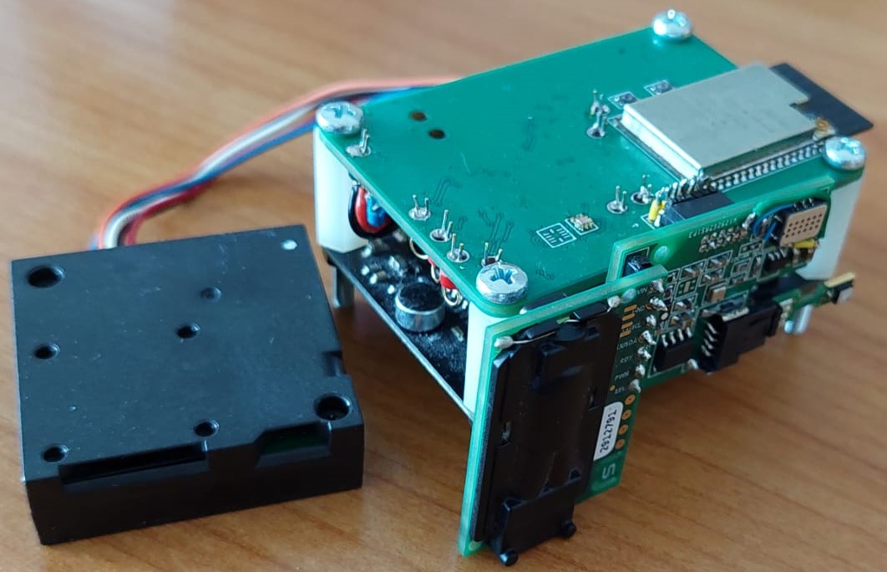 
    <h1>Air quality monitoring system ( documentation in progress )</h1>
</div>


<!-- ______________________________________________________________________________________________________________________________________________________ INTRODUCTION -->
# :rocket: Introduction


<!-- ______________________________________________________________________________________________________________________________________________________ TABLE OF CONTENT -->
# :ledger:Table of content

- [:rocket: Introduction](#rocket-introduction)
- [:ledger:Table of content](#ledgertable-of-content)
- [:page\_facing\_up: About the project](#page_facing_up-about-the-project)
  - [Programs used](#programs-used)
  - [File structure](#file-structure)
- [:gear: Components](#gear-components)
  - [ESP32-­WROVER­-IB](#esp32-wrover-ib)
  - [ADT7410](#adt7410)
  - [SHT85](#sht85)
  - [SEN0232](#sen0232)
  - [OPT3001](#opt3001)
  - [MiCS-5524](#mics-5524)
  - [SN-GCJA5L](#sn-gcja5l)
  - [SGP40](#sgp40)
  - [BMI270](#bmi270)
  - [BME280](#bme280)
  - [SCD30](#scd30)
  - [CP2102N](#cp2102n)
  - [PCA9517A](#pca9517a)
  - [MCP3221](#mcp3221)
- [Hardware implementation](#hardware-implementation)
  - [Device architecture](#device-architecture)
  - [Main board](#main-board)
  - [Sensor board](#sensor-board)
  - [Final device](#final-device)
- [Software implementation](#software-implementation)
  - [Microcontroller](#microcontroller)
  - [Dashboard](#dashboard)
- [:partying\_face: Results](#partying_face-results)
- [:fire: Demo](#fire-demo)
- [:star2: Future work](#star2-future-work)
- [:checkered\_flag: Conclusions](#checkered_flag-conclusions)
- [:mag\_right: Resources](#mag_right-resources)
- [:question: Glossary](#question-glossary)


<!-- ______________________________________________________________________________________________________________________________________________________ ABOUT THE PROJECT -->
# :page_facing_up: About the project


The device must monitor the following parameters:
1. temperature
2. humidity
3. air pressure
4. CO2 quantity
5. PM particles density
6. TVOC
7. luminosity
8. acceleration and gyro
 
A customized device was developed to achieve the previously mentioned objectives.

The acronyms used during the device presentation can be found in the [Glossary](#mag_right-glossary) section.

<!-- ------------------------------------------------------------------------------------------------------------------------------------------------------ PROGRAMS USED -->
## Programs used

Multiple tools were utilized during the development of the project, and they are listed below:
+ Altium Designer: schematic and PCB designing
+ Arduino: embedded programming

A logic analyzer was used for low level debugging.


<!-- ------------------------------------------------------------------------------------------------------------------------------------------------------ FILE STRUCTURE -->
## File structure

The file structure of the project can be seen in the following figure:
```
.
├── docs
│   └── images ( photos used in README )
└── README.md
```

<!-- </details> -->

<!-- ______________________________________________________________________________________________________________________________________________________ COMPONENTS -->
# :gear: Components
    
In this section, the components used to implement the device will be presented. 
At first, the component list will be shown, after which the most important capabilities of the main components will be detailed.

The following list contains the components needed to build the device:
+ main components
    + 1x ESP32-­WROVER­-B microcontroller
        + [ Link datasheet ESP32-­WROVER­-B ]( https://www.espressif.com/sites/default/files/documentation/esp32-wrover-b_datasheet_en.pdf )
    + 1x ADT7410 temperature sensor
        + [ Link datasheet ADT7410 ]( https://ro.mouser.com/datasheet/2/609/ADT7410-1503456.pdf )
    + 1x SHT85 temperature and humidity sensor
        + [ Link datasheet SHT85 ]( https://www.mouser.com/datasheet/2/682/Sensirion_Humidity_Sensors_SHT85_Datasheet-1501398.pdf )
    + 1x SEN0232 sound level sensor
        + [ Link datasheet SEN0232 ]( https://www.mouser.de/pdfdocs/SEN0232_Web.pdf )
    + 1x SCD30 CO2, humidity, and temperature sensor
        + [ Link datasheet SCD30 ]( https://www.mouser.com/datasheet/2/682/Sensirion_CO2_Sensors_SCD30_Datasheet-1901872.pdf )
    + 1x OPT3001 ambient light sensor
        + [ Link datasheet OPT3001 ]( https://www.ti.com/lit/ds/symlink/opt3001.pdf?ts=1630915821822 )
    + 1x SGP40 TVOC sensor
        + [ Link datasheet SGP40 ]( https://ro.mouser.com/datasheet/2/682/Sensirion_Gas_Sensors_Datasheet_SGP40-2001008.pdf )
    + 1x MICS5524 TVOC analog sensor
        + [ Link datasheet MICS5524 ]( https://cdn-shop.adafruit.com/product-files/3199/MiCS-5524.pdf )
    + 1x SN-GCJA5L PM particles sensor
        + [ Link datasheet SN-GCJA5L ]( https://www.mouser.com/catalog/specsheets/Panasonic_SN-GCJA5%20Data%20Sheet.pdf )
    + 1x BMI270 6 axes IMU sensor
        + [ Link datasheet BMI270 ]( https://download.mikroe.com/documents/datasheets/bst-bmi270-ds000-2_datasheet.pdf )
    + 1x BME280 pressure, humidity and temperature sensor
        + [ Link datasheet BME280 ]( https://www.mouser.com/datasheet/2/783/BST-BME280-DS002-1509607.pdf )
    + 1x CP2102N USB-UART bridge
        + [ Link datasheet CP2102N ]( https://www.silabs.com/documents/public/data-sheets/cp2102n-datasheet.pdf )
    + 1x PCA9517A level shifter I2C bus repeater
        + [ Link datasheet PCA9517A ]( https://www.farnell.com/datasheets/2578416.pdf )
    + 1x MCP3221 external 12-bits ADC
        + [ Link datasheet MCP3221 ]( https://ro.mouser.com/datasheet/2/268/mchp_s_a0002844534_1-2274805.pdf )
+ auxiliary components
    + 1x barrel jack connector and wall adapter
    + 4x M3x30 screws and 4x spacers
    + multiple male and female headers, cables & test points


<!-- ------------------------------------------------------------------------------------------------------------------------------------------------------ ESP32-­WROVER­-IB -->
## ESP32-­WROVER­-IB

**FIGURE 1: ESP32-­WROVER­-IB module**

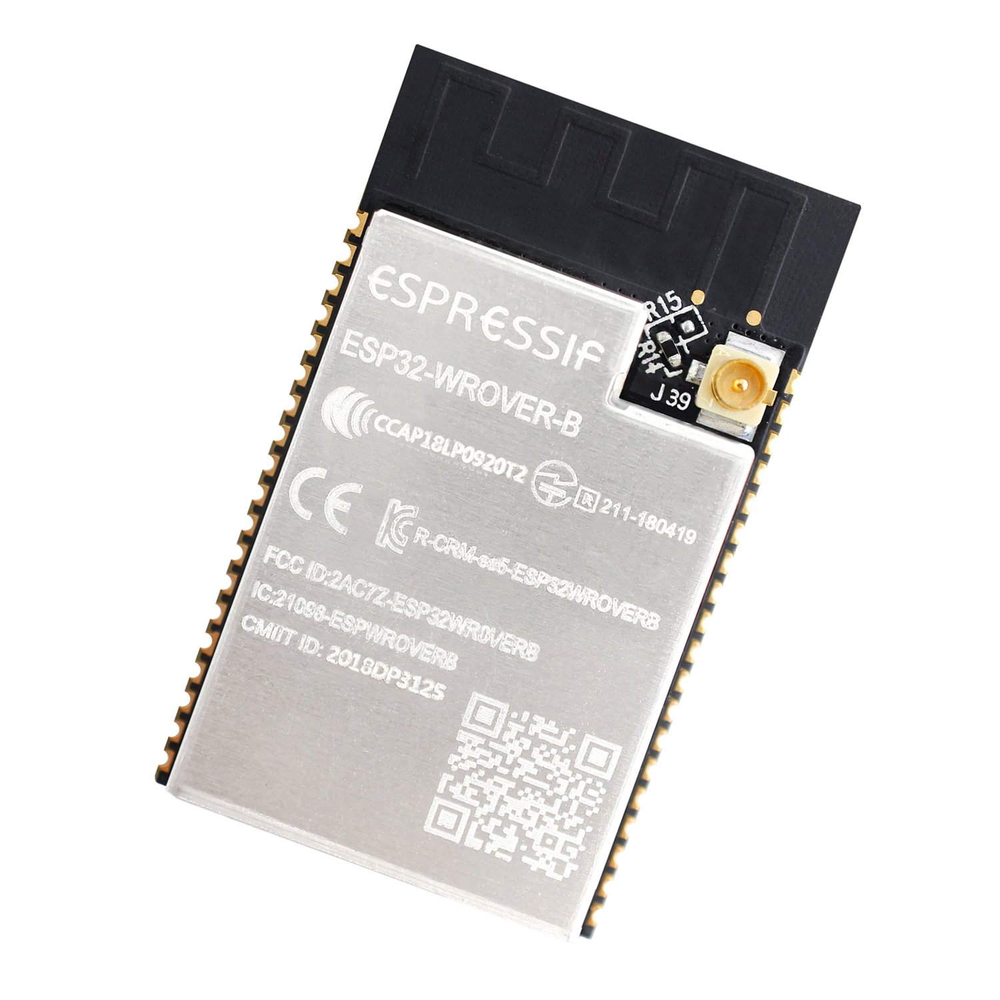

The microcontroller chosen to be used is the [ ESP32-­WROVER­-IB ]( https://www.espressif.com/sites/default/files/documentation/esp32-wrover-b_datasheet_en.pdf ) module from Espressif.
The resources available on the Internet, more precisely examples and various libraries, make it a perfect choice for IoT applications.


**FIGURE 2: ESP32 functional blocks**

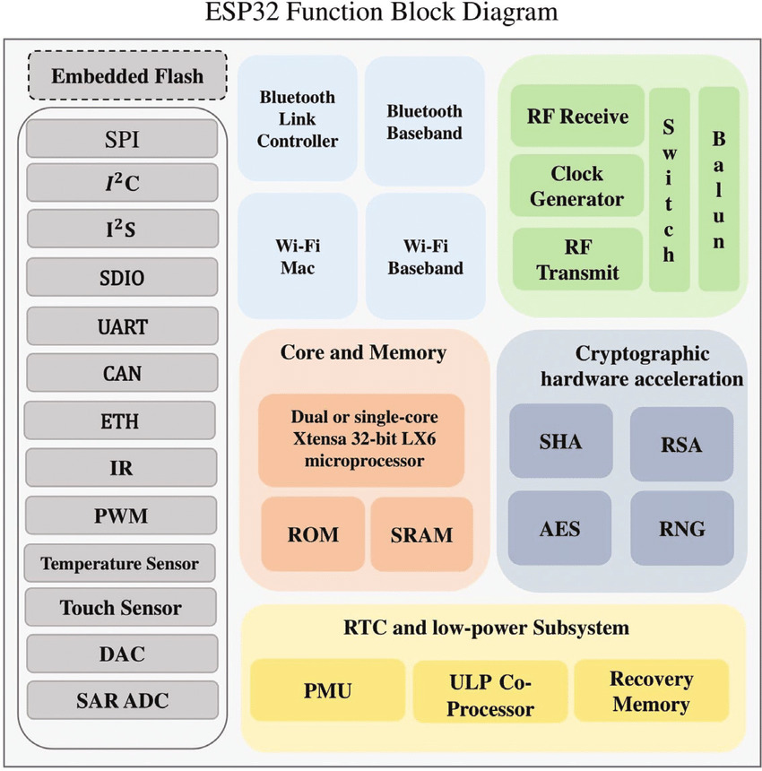

The module features integrated wireless communication, including Wi-Fi. 
It also supports typical intraboard serial communication protocols such as SPI, I2C, and UART. 
The power of the antenna used for data transmission can be adjusted depending on its position in relation to the router, which helps achieve lower energy consumption. 
Its minimalist design takes up little space, making it easy to integrate into the device.


<!-- ------------------------------------------------------------------------------------------------------------------------------------------------------ ADT7410 -->
## ADT7410

The [ ADT7410 ]( https://ro.mouser.com/datasheet/2/609/ADT7410-1503456.pdf ) is a high accuracy **temperature sensor**, capable of measuring temperatures between −55 °C and +150 °C. 
Its accuracy ranges from ±0.4°C to ±1.0°C, depending on the measurement range and supply voltage. 
The resolution of the ADC can be selected between 13 and 16 bits ( sign + 12 or 15 data bits ).
Alerts such as overtemperature, undertemperature, and critical overtemperature can be configured using the INT and CT pins, with programmable limit settings. 
The INT pin can operate in either interrupt mode or comparator mode.

The sensor communicates via the I2C protocol, supporting speeds of up to 400 kHz.
The last two I2C address bits are configurable through the A0 and A1 pins, allowing for four possible address variations. 
It operates at a supply voltage range of 2.7V to 5.5V.


<!-- ------------------------------------------------------------------------------------------------------------------------------------------------------ SHT85-->
## SHT85

The [ SHT85 ]( https://www.mouser.com/datasheet/2/682/Sensirion_Humidity_Sensors_SHT85_Datasheet-1501398.pdf ) is a very high accuracy **humidity and temperature sensor**.
Its measurement ranges are [ 0, 100 ] %RH for humidity and [ -40, 105 ] °C for temperature, with a typical accuracy of ±1.5% RH ( over the range [ 0, 80 ] %RH ) and ±0.1°C ( for the range [ 20, 50 ] °C ). 
The package design ensures the best possible thermal coupling to the environment and decoupling from potential heat sources on the main board. 
It features a PTFE membrane that protects the sensor opening from liquids and dust according to the IP67 standard, without affecting the response time of the RH signal. 
This makes it suitable for use in harsh environmental conditions.
Additionally, data and commands are protected with an 8-bit CRC checksum, which increases communication reliability.

The sensor uses the I2C protocol, supporting speeds up to 1 MHz and a single I2C address.
It operates at voltages ranging from 2.15V to 5.5V, with a typical operating voltage of 3.3V.


<!-- ------------------------------------------------------------------------------------------------------------------------------------------------------ SEN0232 -->
## SEN0232

The [ SEN0232 ]( https://www.mouser.de/pdfdocs/SEN0232_Web.pdf ) is a plug and play **sound level meter** board.
Its measurement range is 30 dBA to 150 dBA, with a measurement error of ±1.5 dB. 
An important aspect is that the A-weighted decibel ( dBA ) is an expression of the relative loudness of sounds as perceived by the human ear, meaning the sound level is normalized to human hearing. 
The sensor's output is an analog signal ranging from 0.6V to 2.6V.

It can operate on either 3.3V or 5V voltage levels.


<!-- ------------------------------------------------------------------------------------------------------------------------------------------------------ OPT3001 -->
## OPT3001

The [ OPT3001 ]( https://www.ti.com/lit/ds/symlink/opt3001.pdf?ts=1630915821822 ) is an **ambient light sensor** capable of measuring values between 0.01 lux and 83 klux. 
The spectral response of the sensor closely matches the photopic response of the human eye and includes significant infrared rejection, typically rejecting over 99% of IR. 
This strong IR rejection also helps maintain high accuracy when mounting the sensor under dark glass. 
Additionally, the effects of 50-Hz and 60-Hz noise from typical light bulbs are minimized by integrating the results over either 100 ms or 800 ms. 
Interrupts can be generated using the INT pin by comparing the measurement results to programmable low and high limit values.

The sensor uses the I2C protocol, with speeds of up to 2.6 MHz. 
There are four possible I2C addresses, selectable via the ADDR pin by connecting it to GND, VDD, SDA, or SCL. 
Its operating voltage is 3.3V.


<!-- ------------------------------------------------------------------------------------------------------------------------------------------------------ MICS5524 -->
## MiCS-5524

The [ MiCS-5524 ]( https://cdn-shop.adafruit.com/product-files/3199/MiCS-5524.pdf ) is an **indoor gas detector** for carbon monoxide and natural gas leakages.
The sensor can detect multiple gases, namely carbon monoxide ( CO ), ethanol ( C2H6OH ), hydrogen ( H2 ), ammonia ( NH3 ) and methane ( CH4 ), at various concentrations. 
However, it cannot distinguish which specific gas is being detected.

The sensor is essentially composed of a heater and an external resistor. 
The voltage across the external resistor can then be measured by an ADC. 
The operating voltage of the sensor is 5V.


<!-- ------------------------------------------------------------------------------------------------------------------------------------------------------ SN-GCJA5L -->
## SN-GCJA5L

The [ SN-GCJA5L ]( https://www.mouser.com/catalog/specsheets/Panasonic_SN-GCJA5%20Data%20Sheet.pdf ) is a laser type **PM sensor**.
The accuracy of the sensor is ±10% across low to high concentrations. 
The sensor detects particles using an optical method, with a laser diode as the light-emitting device and a photodiode as the light-receiving device. 
The laser diode emits light, while the photodiode detects scattered light, which is correlated to the actual floating particles in the air. 
A microprocessor inside the sensor analyzes the wave profile from the photodiode using a special algorithm, then outputs a converted mass-density.

It provides two digital interfaces: I2C ( up to 400 kHz ) and UART ( fixed at 9600 baud rate ). 
The I2C address cannot be changed.
The operating voltage is 5V, but its digital interface supports only 3.3V.


<!-- ------------------------------------------------------------------------------------------------------------------------------------------------------ SGP40 -->
## SGP40

The [ SGP40 ]( https://ro.mouser.com/datasheet/2/682/Sensirion_Gas_Sensors_Datasheet_SGP40-2001008.pdf ) is an **indoor air quality sensor** used for VOC measurements.
It is designed for air purifiers or demand-controlled ventilation systems.
The sensor features a temperature controlled micro hotplate, providing a humidity compensated VOC based indoor air quality signal. 
The output signal can be directly processed by a VOC algorithm to translate the raw signal into a VOC Index, which serves as a robust measure of indoor air quality.

The sensor uses the I2C protocol, supports speeds of up to 400 kHz, and has a single I2C address. 
The typical operating voltage is 3.3V.


<!-- ------------------------------------------------------------------------------------------------------------------------------------------------------ BMI270 -->
## BMI270

The [ BMI270 ]( https://download.mikroe.com/documents/datasheets/bst-bmi270-ds000-2_datasheet.pdf ) is a **6-axis IMU sensor**.
Both the triaxial accelerometer and gyroscope have 16-bit resolution with various programmable ranges. 
Multiple low-pass filters are available for configuration to reduce noise. 
There are two I/O pins designated for interrupts and synchronization events.

Two serial interfaces are available: I2C ( up to 400 kHz ) and SPI ( 3 or 4 wires, up to 10 MHz ).
Its typical working voltage is 1.8 volts.


<!-- ------------------------------------------------------------------------------------------------------------------------------------------------------ BME280 -->
## BME280

The [ BME280 ]( https://www.mouser.com/datasheet/2/783/BST-BME280-DS002-1509607.pdf ) is a **humidity, temperature and pressure sensor**.
It can measure humidity from 0 to 100% RH with an absolute tolerance of ±3% RH ( over the range [ 20%, 80% ] at 25 °C ) and pressure from 300 to 1100 hPa with an accuracy of ±1.0 to ±1.7 hPa, depending on the temperature interval.

The chip supports both I2C ( up to 3.4 MHz ) and SPI ( 3 or 4 wires, up to 10 MHz ) digital interfaces.
There are two I2C addresses available for selection. 
Its typical operating voltage is 1.8V, but it can also function at 3.3V according to the datasheet.


<!-- ------------------------------------------------------------------------------------------------------------------------------------------------------ SCD30 -->
## SCD30

The [ SCD30 ]( https://www.mouser.com/datasheet/2/682/Sensirion_CO2_Sensors_SCD30_Datasheet-1901872.pdf ) is a **CO2 sensor, with integrated humidity and temperature measurements**.
It can measure CO2 concentrations from 400 to 10,000 ppm with an accuracy of ±30 ppm + 3% of the measured value, humidity from 0% to 100% RH with ±3% RH accuracy ( at 25 °C ), and temperature from -40 °C to 70 °C with an accuracy of ±( 0.4 °C + 0.023 * ( T [°C] – 25 °C ) ) over the range of 0°C to 50°C.

The chip supports I2C ( up to 100 kHz ) and UART digital interfaces.
There is a single I2C address available for selection, and the I2C data is protected with an 8-bit CRC checksum to increase communication reliability. 
Its operating voltage ranges from 3.3 to 5.5 volts.


<!-- ------------------------------------------------------------------------------------------------------------------------------------------------------ CP2102N -->
## CP2102N

The [ CP2102N ]( https://www.silabs.com/documents/public/data-sheets/cp2102n-datasheet.pdf ) is a **USB-UART bridge** that can be used to interface a laptop with a microcontroller.
The number of auxiliary components is kept to a minimum, thus reducing costs and saving space. 
The chip can be configured using a simple GUI-based configurator. 
Multiple pins ( such as RST ( Request To Send ) and DTR ( Data Terminal Ready ) ) are available for flow control.
CP2102N devices enable quick USB connectivity with minimal development effort.


<!-- ------------------------------------------------------------------------------------------------------------------------------------------------------ PCA9517A -->
## PCA9517A

The [ PCA9517A ]( https://www.farnell.com/datasheets/2578416.pdf ) is an **I2C bus repeater** that provides level shifting between low voltage ( 0.9 to 5.5 V ) and higher voltage ( 2.7 to 5.5 V ) for I2C−bus or SMBus applications.
It retains all the operating modes and features of the I2C bus system during level shifts and permits the extension of the I2C bus by providing bidirectional buffering for both the SDA and SCL lines.
The bidirectional buffer isolates the capacitances on both sides, thus enabling two buses with up to 400 pF capacitance each. 
It supports a frequency of up to 1 MHz. 
The supply voltages for the two ports are 0.9 to 5.5 V and 2.7 to 5.5 V.


<!-- ------------------------------------------------------------------------------------------------------------------------------------------------------ MCP3221 -->
## MCP3221

The [ MCP3221 ]( https://ro.mouser.com/datasheet/2/268/mchp_s_a0002844534_1-2274805.pdf ) is an **SAR ADC with a 12-bit resolution**, featuring one single-ended input and very low power consumption. 
An on-chip conversion clock enables independent timing for the I2C and conversion clocks.

The sensor uses the I2C protocol and supports speeds up to 400 kHz. 
The device has a single I2C address set at the factory, but there are 8 chip versions available ( A0 to A7 ), each with its unique address.
The version is specified after the chip's name ( MCP3221XX ).
The MCP3221 operates on a single-supply voltage with a broad range of 2.7V to 5.5V.


<!-- ______________________________________________________________________________________________________________________________________________________ HARDWARE IMPLEMENTATION -->
# Hardware implementation

In this section, the hardware implementation of the device will be detailed.

For each board, the block diagrams will be presented first, where the connections between the components can be seen. 
The following colors are used to represent the functionality:

- ${\textsf{\color{red}red}}$ and ${\textsf{\color{blue}blue}}$ - DC power supply
- ${\textsf{\color{orange}orange}}$ - analog signals
- ${\textsf{\color{purple}purple}}$ - digital signals

The layout and assembled boards will be presented at the end.


<!-- ------------------------------------------------------------------------------------------------------------------------------------------------------ Device architecture -->
## Device architecture


The functionality of the device was divided into 2 PCBs, as follows:

- **Board P1 ( Main board )**: supplies the voltage level needed by the components; the ESP32 and the sensors which don't need direct contact with the air ( light, accel + gyro, sound ) are placed on this board; the PM particle sensor connects to this bard using a header
- **Board P2 ( Sensor board )**: the sensors which need direct contact with the air ( temperature, humidity, CO2, TVOC, air pressure ) are placed on this board

The architecture of the entire system can be seen in the figure below. 

**FIGURE 3: Device architecture**

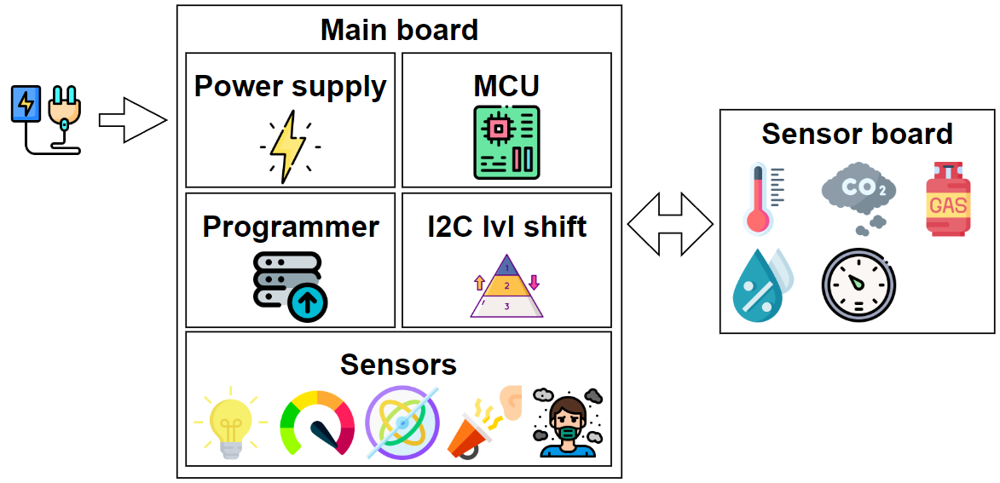


## Main board

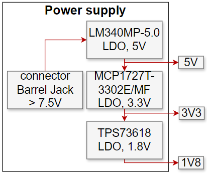

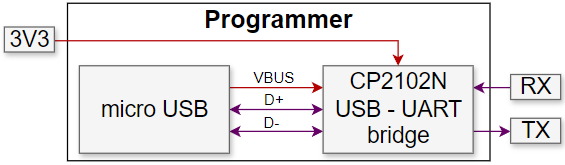

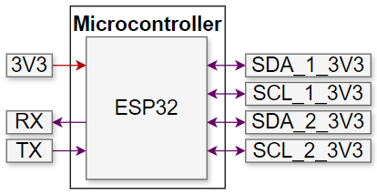

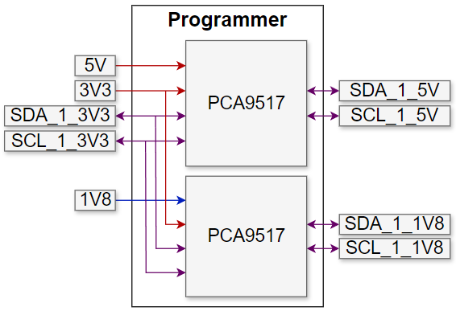

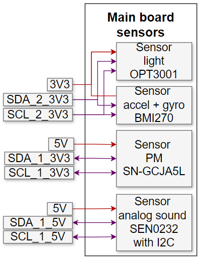

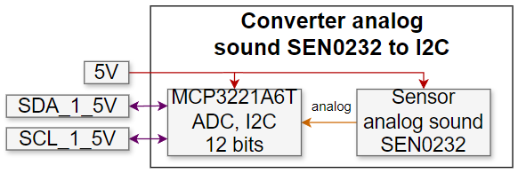


## Sensor board

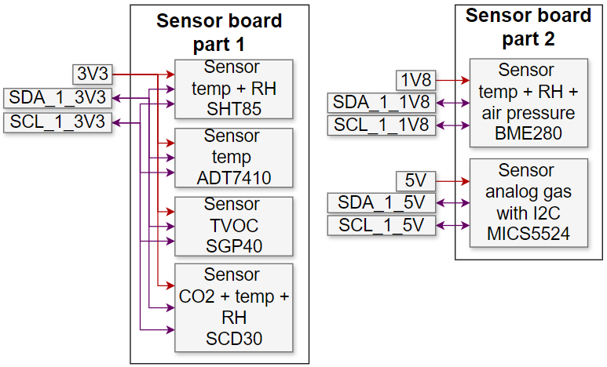

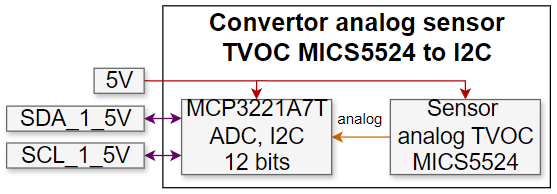


## Final device


# Software implementation

## Microcontroller

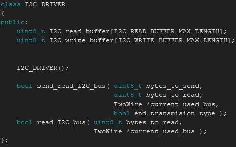

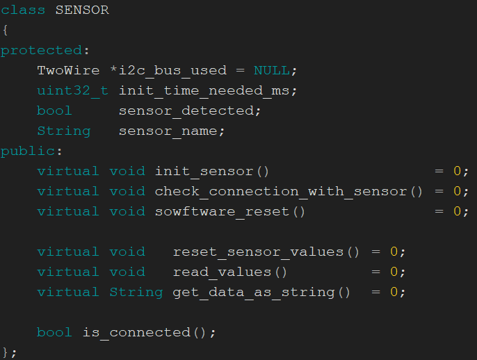

## Dashboard

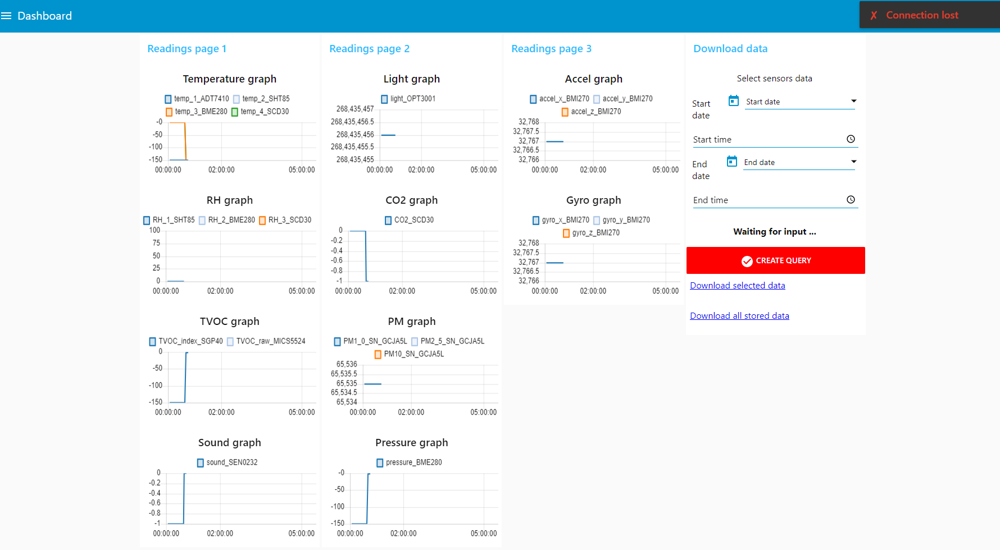

<!-- ______________________________________________________________________________________________________________________________________________________ RESULTS -->
# :partying_face: Results

<!-- ______________________________________________________________________________________________________________________________________________________ DEMO -->
# :fire: Demo

<!-- ______________________________________________________________________________________________________________________________________________________ FUTURE WORK -->
# :star2: Future work


<!-- ______________________________________________________________________________________________________________________________________________________ CONCLUSION -->
# :checkered_flag: Conclusions


<!-- ______________________________________________________________________________________________________________________________________________________ RESOURCES -->
# :mag_right: Resources


<!-- ______________________________________________________________________________________________________________________________________________________ GLOSSARY -->
# :question: Glossary

