<div align="center">
    <h1>Indoor Air Quality Monitoring System</h1>
    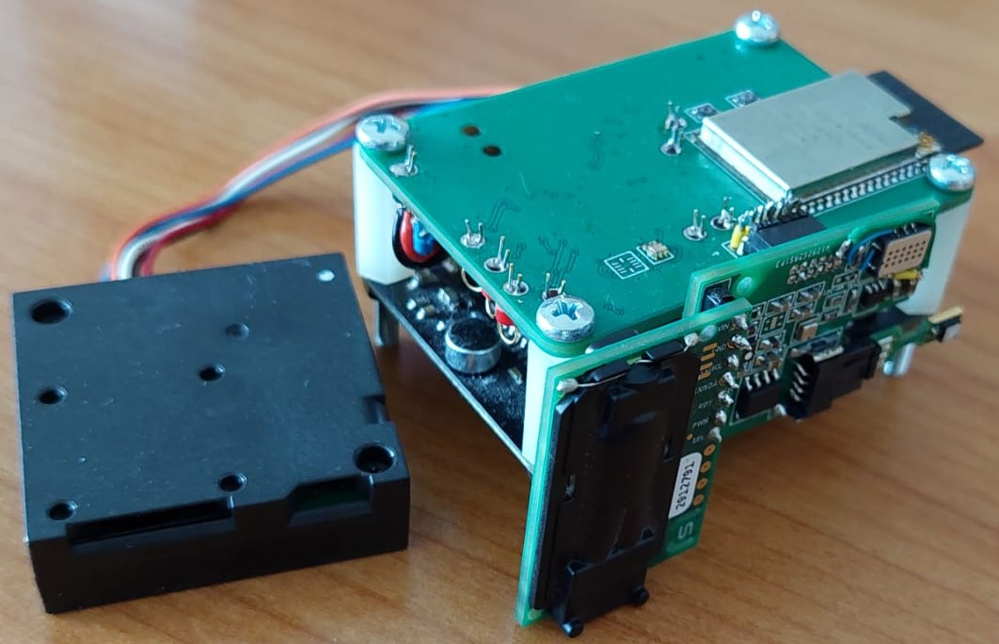
</div>


<!-- ______________________________________________________________________________________________________________________________________________________ -->
# 🚀 Introduction

This project implements a custom embedded system for **real-time indoor air quality monitoring**.
The device measures multiple environmental parameters and transmits the collected data to a dashboard for visualization and analysis.

The system combines **custom hardware, embedded firmware, wireless communication, and a data visualization dashboard**, providing a complete end-to-end monitoring solution.

A demonstration of the system is available in the [Demo](#-demo) section.
Additional hardware and dashboard photos are available in the [Hardware Part 1](#layout), [Hardware Part 2](#layout-1), and [Dashboard](#final-dashboard) sections.

<!-- ______________________________________________________________________________________________________________________________________________________ -->
# 📒 Table of content

- [🚀 Introduction](#-introduction)
- [📒 Table of content](#-table-of-content)
- [📄 About the Project](#-about-the-project)
  - [Monitored Parameters](#monitored-parameters)
  - [System Architecture](#system-architecture)
- [🛠️ Development Tools](#️-development-tools)
- [📁 Repository Structure](#-repository-structure)
- [⚙️ Components](#️-components)
  - [Microcontroller](#microcontroller)
    - [ESP32-­WROVER­-IB](#esp32-wrover-ib)
  - [Temperature and humidity](#temperature-and-humidity)
    - [ADT7410](#adt7410)
    - [SHT85](#sht85)
    - [BME280](#bme280)
    - [SCD30](#scd30)
  - [Air quality](#air-quality)
    - [SN-GCJA5L](#sn-gcja5l)
    - [SGP40](#sgp40)
    - [MiCS-5524](#mics-5524)
  - [Sound](#sound)
    - [SEN0232](#sen0232)
  - [Light and motion](#light-and-motion)
    - [OPT3001](#opt3001)
    - [BMI270](#bmi270)
  - [Interface and support](#interface-and-support)
    - [CP2102N](#cp2102n)
    - [PCA9517A](#pca9517a)
    - [MCP3221](#mcp3221)
- [🧰 Hardware implementation](#-hardware-implementation)
  - [Device architecture](#device-architecture)
  - [Main board](#main-board)
    - [Layout](#layout)
  - [Sensor board](#sensor-board)
    - [Layout](#layout-1)
  - [Final device](#final-device)
- [💻 Software implementation](#-software-implementation)
  - [Microcontroller](#microcontroller-1)
  - [Dashboard](#dashboard)
    - [Node-RED](#node-red)
    - [MQTT](#mqtt)
    - [Final dashboard](#final-dashboard)
- [🔥 Demo](#-demo)
- [🥳 Results and limitations](#-results-and-limitations)
- [🏁 Conclusions](#-conclusions)
- [🔎 Resources](#-resources)
- [❓ Glossary](#-glossary)


<!-- ______________________________________________________________________________________________________________________________________________________ -->
# 📄 About the Project

This project implements a **custom embedded system for indoor environmental monitoring**, combining custom PCBs, multiple sensors, embedded firmware, Wi-Fi connectivity, MQTT communication, and a Node-RED dashboard.


## Monitored Parameters

* Temperature
* Humidity
* Atmospheric pressure
* CO₂ concentration
* Particulate matter ( PM )
* Total volatile organic compounds ( TVOC )
* Luminosity
* Acceleration
* Angular acceleration


## System Architecture

The device is divided into two PCBs based on functionality:

* **Sensor board** — contains the environmental sensors and components requiring direct exposure to the surrounding air.
* **Main board** — contains the microcontroller, communication interfaces, power management, and remaining system components.

This separation isolates the main electronics from direct environmental exposure while providing a modular hardware architecture.

The microcontroller periodically acquires sensor data and transmits it over **Wi-Fi using MQTT**.
The data is stored on a server and made available through a **Node-RED web dashboard**, where users can visualize historical measurements and perform queries and filtering for further analysis.

Additional terminology and external resources are available in the [Glossary](#-glossary) and [Resources](#-resources) sections.


<!-- ______________________________________________________________________________________________________________________________________________________ -->
# 🛠️ Development Tools

* **Altium Designer** — schematic capture and PCB design
* **Arduino IDE** — embedded firmware development
* **Logic analyzer** — low-level debugging and communication analysis


<!-- ______________________________________________________________________________________________________________________________________________________ -->
# 📁 Repository Structure

```
.
├── docs/
│   └── images/    # Images used in the documentation
└── README.md
```


<!-- ______________________________________________________________________________________________________________________________________________________ -->
# ⚙️ Components

The system uses an **ESP32-WROVER-B** as the main controller and integrates dedicated sensors for environmental, air-quality, motion, and light measurements.

The final sensor selection was a compromise between measurement performance, interface compatibility, physical integration, cost, and availability.

The main components are listed below:

| Component      | Quantity | Purpose                                                     | Link                                                                                                       |
| :------------- | :------: | :---------------------------------------------------------- | :--------------------------------------------------------------------------------------------------------- |
| ESP32-WROVER-B |     1    | Main microcontroller and Wi-Fi connectivity                 | [Datasheet](https://www.espressif.com/sites/default/files/documentation/esp32-wrover-b_datasheet_en.pdf)   |
| ADT7410        |     1    | Temperature measurement                                     | [Datasheet](https://ro.mouser.com/datasheet/2/609/ADT7410-1503456.pdf)                                     |
| SHT85          |     1    | Temperature and humidity measurement                        | [Datasheet](https://www.mouser.com/datasheet/2/682/Sensirion_Humidity_Sensors_SHT85_Datasheet-1501398.pdf) |
| SEN0232        |     1    | Sound level measurement                                     | [Datasheet](https://www.mouser.de/pdfdocs/SEN0232_Web.pdf)                                                 |
| SCD30          |     1    | CO₂, temperature, and humidity measurement                  | [Datasheet](https://www.mouser.com/datasheet/2/682/Sensirion_CO2_Sensors_SCD30_Datasheet-1901872.pdf)      |
| OPT3001        |     1    | Ambient light measurement                                   | [Datasheet](https://www.ti.com/lit/ds/symlink/opt3001.pdf?ts=1630915821822)                                |
| SGP40          |     1    | TVOC measurement                                            | [Datasheet](https://ro.mouser.com/datasheet/2/682/Sensirion_Gas_Sensors_Datasheet_SGP40-2001008.pdf)       |
| MiCS-5524      |     1    | Analog gas / TVOC measurement                               | [Datasheet](https://cdn-shop.adafruit.com/product-files/3199/MiCS-5524.pdf)                                |
| SN-GCJA5L      |     1    | Particulate matter ( PM ) measurement                       | [Datasheet](https://www.mouser.com/catalog/specsheets/Panasonic_SN-GCJA5%20Data%20Sheet.pdf)               |
| BMI270         |     1    | 6-axis inertial measurement                                 | [Datasheet](https://download.mikroe.com/documents/datasheets/bst-bmi270-ds000-2_datasheet.pdf)             |
| BME280         |     1    | Atmospheric pressure, temperature, and humidity measurement | [Datasheet](https://www.mouser.com/datasheet/2/783/BST-BME280-DS002-1509607.pdf)                           |
| CP2102N        |     1    | USB-to-UART interface                                       | [Datasheet](https://www.silabs.com/documents/public/data-sheets/cp2102n-datasheet.pdf)                     |
| PCA9517A       |     1    | I²C level shifting / bus buffering                          | [Datasheet](https://www.farnell.com/datasheets/2578416.pdf)                                                |
| MCP3221        |     1    | 12-bit external ADC                                         | [Datasheet](https://ro.mouser.com/datasheet/2/268/mchp_s_a0002844534_1-2274805.pdf)                        |


Auxiliary components:

| Component                            | Quantity | Purpose                   |
| :----------------------------------- | :------: | :------------------------ |
| Barrel jack connector + wall adapter |     1    | Power input               |
| M3×30 mm screws + spacers            |   4 + 4  | PCB mounting              |
| Male / female headers                | Multiple | PCB interconnection       |
| Cables                               | Multiple | Internal connections      |
| Test points                          | Multiple | Debugging and measurement |


<!-- ------------------------------------------------------------------------------------------------------------------------------------------------------ -->
## Microcontroller
<!-- ------------------------------------------------------------------------------------------------------------------------------------------------------ -->
### ESP32-­WROVER­-IB

**Figure: ESP32-WROVER-IB module**

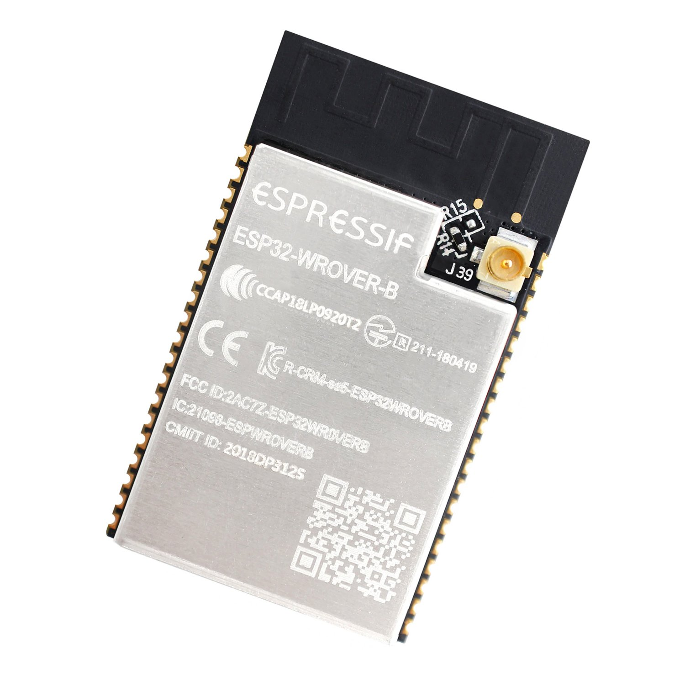

The [ ESP32-­WROVER­-IB ]( https://www.espressif.com/sites/default/files/documentation/esp32-wrover-b_datasheet_en.pdf ) module from Espressif was selected as the main microcontroller for the system.
It provides the processing capabilities, peripheral interfaces, and wireless connectivity required by the application.

**Figure: ESP32 functional blocks**

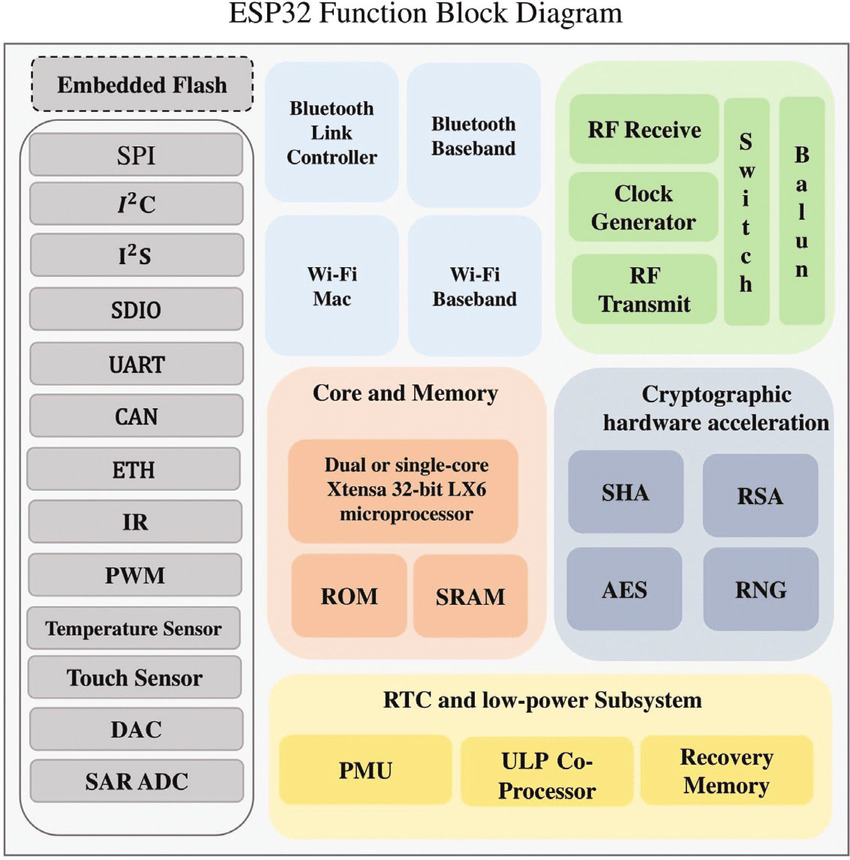

The module integrates **2.4 GHz Wi-Fi** and supports common embedded communication interfaces, including **SPI, I²C, and UART**.
The ESP32 provides configurable Wi-Fi transmit power, allowing the wireless interface to be adapted to the required communication range and power consumption.

Its compact module form factor simplifies integration with the custom PCB while providing the connectivity required for the IoT application.


<!-- ------------------------------------------------------------------------------------------------------------------------------------------------------ -->
## Temperature and humidity
<!-- -------------------------------------------------------------------------c----------------------------------------------------------------------------- -->
### ADT7410

The [ADT7410](https://ro.mouser.com/datasheet/2/609/ADT7410-1503456.pdf) is a high-accuracy **digital temperature sensor** used for ambient temperature monitoring.

Key specifications:

* **Measurement range:** −55 °C to +150 °C
* **Accuracy:** up to ±0.4 °C, depending on operating conditions
* **Resolution:** 13-bit or 16-bit
* **Interface:** I²C, up to 400 kHz
* **I²C addresses:** 4 configurable addresses using A0 / A1
* **Supply voltage:** 2.7 V – 5.5 V
* **Alerts:** programmable overtemperature and undertemperature limits via INT/CT

The sensor is connected to the ESP32 through the **I²C bus**, allowing the firmware to periodically acquire temperature measurements alongside data from the other environmental sensors.


<!-- ------------------------------------------------------------------------------------------------------------------------------------------------------ -->
### SHT85

The [SHT85](https://www.mouser.com/datasheet/2/682/Sensirion_Humidity_Sensors_SHT85_Datasheet-1501398.pdf) is a high-accuracy **digital temperature and humidity sensor** used for environmental monitoring.

Key specifications:

* **Humidity range:** 0–100 %RH
* **Temperature range:** −40 °C to +105 °C
* **Typical humidity accuracy:** ±1.5 %RH ( over [ 0, 80 ] %RH )
* **Typical temperature accuracy:** ±0.1 °C ( over [ 20, 50 ] °C )
* **Interface:** I²C, up to 1 MHz
* **I²C address:** 1 fixed address
* **Supply voltage:** 2.15 V – 5.5 V
* **Typical supply voltage:** 3.3 V
* **Data integrity:** 8-bit CRC

The SHT85 is equipped with a **PTFE membrane** that protects the sensing element against dust and liquids while maintaining the humidity sensor's response characteristics.
Its package is designed to provide good thermal coupling to the surrounding environment while reducing the influence of heat generated by nearby electronics.

The sensor communicates with the ESP32 over the **I²C bus**.
CRC-based data validation is used to detect communication errors during measurement transfers.


<!-- ------------------------------------------------------------------------------------------------------------------------------------------------------ -->
### BME280

The [BME280](https://www.mouser.com/datasheet/2/783/BST-BME280-DS002-1509607.pdf) is a digital **temperature, humidity, and atmospheric pressure sensor**.

Key specifications:

* **Humidity range:** 0–100 %RH
* **Humidity accuracy:** ±3 %RH
* **Pressure range:** 300–1100 hPa
* **Pressure accuracy:** ±1.0–1.7 hPa
* **Interfaces:** I²C, up to 3.4 MHz; SPI, up to 10 MHz
* **I²C addresses:** 2 configurable addresses
* **Supply voltage:** 1.71–3.6 V

The BME280 communicates with the ESP32 through **I²C** and provides atmospheric pressure measurements alongside temperature and humidity data.

<!-- ------------------------------------------------------------------------------------------------------------------------------------------------------ -->
### SCD30

The [SCD30](https://www.mouser.com/datasheet/2/682/Sensirion_CO2_Sensors_SCD30_Datasheet-1901872.pdf) is a digital **CO₂ sensor** with integrated temperature and humidity measurements.

Key specifications:

* **CO₂ range:** 400–10,000 ppm
* **CO₂ accuracy:** ±30 ppm + 3% of measured value
* **Humidity range:** 0–100 %RH
* **Humidity accuracy:** ±3 %RH
* **Temperature range:** −40 °C to +70 °C
* **Interfaces:** I²C, up to 100 kHz; UART
* **I²C address:** Fixed
* **Data integrity:** 8-bit CRC
* **Supply voltage:** 3.3–5.5 V

The SCD30 communicates with the ESP32 through **I²C**. CRC-based data validation is used to detect communication errors during data transfers.


<!-- ------------------------------------------------------------------------------------------------------------------------------------------------------ -->
## Air quality
<!-- ------------------------------------------------------------------------------------------------------------------------------------------------------ -->
### SN-GCJA5L

The [SN-GCJA5L](https://www.mouser.com/catalog/specsheets/Panasonic_SN-GCJA5%20Data%20Sheet.pdf) is a laser-based **particulate matter ( PM ) sensor** used to measure airborne particle concentration.

The sensor uses an optical measurement principle: a laser diode illuminates particles in the air, while a photodiode detects the resulting scattered light.
An internal processor analyzes the optical signal and converts it into a particle mass-density measurement.

Key specifications:

* **Measurement accuracy:** ±10%
* **Interfaces:** I²C, up to 400 kHz; UART, 9600 baud
* **I²C address:** Fixed
* **Supply voltage:** 5 V
* **Digital interface voltage:** 3.3 V

The sensor communicates with the ESP32 using **I²C**, while its 5 V supply and 3.3 V digital interface levels are handled separately in the hardware design.


<!-- ------------------------------------------------------------------------------------------------------------------------------------------------------ -->
### SGP40

The [SGP40](https://ro.mouser.com/datasheet/2/682/Sensirion_Gas_Sensors_Datasheet_SGP40-2001008.pdf) is a digital **volatile organic compound ( VOC ) sensor** used for indoor air quality monitoring.

The sensor uses a temperature-controlled micro hotplate to provide a humidity-compensated VOC measurement.
Its raw output can be processed using a VOC algorithm to obtain a **VOC Index**, providing a normalized indication of indoor air quality.

Key specifications:

* **Measurement:** VOC
* **Output:** Raw VOC signal / VOC Index
* **Interface:** I²C, up to 400 kHz
* **I²C address:** Fixed
* **Typical supply voltage:** 3.3 V

The sensor communicates with the ESP32 through the **I²C bus**.


<!-- ------------------------------------------------------------------------------------------------------------------------------------------------------ -->
### MiCS-5524

The [MiCS-5524](https://cdn-shop.adafruit.com/product-files/3199/MiCS-5524.pdf) is an **analog gas sensor** used for detecting the presence of gases such as carbon monoxide (CO), ethanol (C₂H₆OH), hydrogen (H₂), ammonia (NH₃), and methane (CH₄).

The sensor does not provide gas-specific identification; its output varies according to the concentration of the detected gases.

Key specifications:

* **Detected gases:** CO, ethanol, H₂, NH₃, CH₄
* **Output:** Analog
* **Supply voltage:** 5 V

The sensor consists of a heated sensing element whose resistance changes in the presence of target gases.
The resulting voltage across the external load resistor is measured using an **ADC** connected to the ESP32.


<!-- ------------------------------------------------------------------------------------------------------------------------------------------------------ -->
## Sound
<!-- ------------------------------------------------------------------------------------------------------------------------------------------------------ -->
### SEN0232

The [SEN0232](https://www.mouser.de/pdfdocs/SEN0232_Web.pdf) is an analog **sound level sensor** used to monitor ambient noise.

Key specifications:

* **Measurement range:** 30–130 dBA
* **Accuracy:** ±1.5 dB
* **Output:** Analog, 0.6 V – 2.6 V
* **Supply voltage:** 3.3 V or 5 V

The sensor provides an **A-weighted sound pressure level ( dBA )**, which approximates the frequency sensitivity of human hearing.

The analog output is connected to the ESP32's **ADC**, where the firmware samples and processes the signal to obtain the sound level measurement.


<!-- ------------------------------------------------------------------------------------------------------------------------------------------------------ -->
## Light and motion
<!-- ------------------------------------------------------------------------------------------------------------------------------------------------------ -->
### OPT3001

The [OPT3001](https://www.ti.com/lit/ds/symlink/opt3001.pdf?ts=1630915821822) is a digital **ambient light sensor** used to measure illuminance.

Key specifications:

* **Measurement range:** 0.01 lux – 83 klux
* **Spectral response:** Designed to closely match the human eye's photopic response
* **IR rejection:** >99% typical
* **Interface:** I²C, up to 2.6 MHz
* **I²C addresses:** 4 configurable addresses
* **Supply voltage:** 3.3 V

The sensor's spectral response is designed to approximate human visual perception while providing strong infrared rejection, improving the accuracy of ambient light measurements under different lighting conditions.

The OPT3001 communicates with the ESP32 through the **I²C bus**. Its configurable address allows it to coexist with other I²C devices in the system.


<!-- ------------------------------------------------------------------------------------------------------------------------------------------------------ -->
### BMI270

The [BMI270](https://download.mikroe.com/documents/datasheets/bst-bmi270-ds000-2_datasheet.pdf) is a **6-axis inertial measurement unit ( IMU )** integrating a 3-axis accelerometer and 3-axis gyroscope.

Both sensors provide 16-bit measurements with configurable measurement ranges and filtering options for reducing measurement noise.
The device also provides two configurable interrupt pins for motion detection and other sensor events.

Key specifications:

* **Sensors:** 3-axis accelerometer + 3-axis gyroscope
* **Resolution:** 16-bit
* **Interfaces:** I²C, up to 400 kHz; SPI, up to 10 MHz
* **Interrupts:** 2 configurable interrupt pins
* **Typical supply voltage:** 1.8 V

The BMI270 communicates with the ESP32 through **I²C**, providing acceleration and angular velocity measurements for motion monitoring.


<!-- ------------------------------------------------------------------------------------------------------------------------------------------------------ -->
## Interface and support
<!-- ------------------------------------------------------------------------------------------------------------------------------------------------------ -->
### CP2102N

The [CP2102N](https://www.silabs.com/documents/public/data-sheets/cp2102n-datasheet.pdf) is a **USB-to-UART bridge** used to provide communication between the ESP32 and a PC.

Key specifications:

* **Interface:** USB 2.0 Full-Speed
* **Serial interface:** UART
* **USB connector:** USB device interface
* **Configuration:** Configurable using Silicon Labs' configuration tools

The CP2102N converts USB communication from the PC into **UART communication** used by the ESP32, providing a convenient interface for device configuration, debugging, and data exchange.


<!-- ------------------------------------------------------------------------------------------------------------------------------------------------------ -->
### PCA9517A

The [PCA9517A](https://www.farnell.com/datasheets/2578416.pdf) is a bidirectional **I²C bus repeater and level shifter** used to interface I²C devices operating at different voltage levels.

Key specifications:

* **Function:** I²C level shifting and bus buffering
* **Low-voltage side:** 0.9–5.5 V
* **High-voltage side:** 2.7–5.5 V
* **Maximum bus frequency:** 1 MHz
* **Supported signals:** SDA and SCL

The PCA9517A provides bidirectional buffering of the **SDA and SCL** lines, allowing I²C devices with different logic-voltage levels to communicate reliably while isolating the bus capacitance between the two sides.


<!-- ------------------------------------------------------------------------------------------------------------------------------------------------------ MCP3221 -->
### MCP3221

The [MCP3221](https://ro.mouser.com/datasheet/2/268/mchp_s_a0002844534_1-2274805.pdf) is a **12-bit single-ended SAR ADC** used to digitize analog signals that cannot be measured directly using the available ESP32 interfaces.

Key specifications:

* **Resolution:** 12-bit
* **Inputs:** 1 single-ended analog input
* **Interface:** I²C, up to 400 kHz
* **I²C addresses:** 8 address variants available
* **Supply voltage:** 2.7–5.5 V
* **Power consumption:** Low-power operation

The MCP3221 communicates with the ESP32 through the **I²C bus**, allowing analog sensor signals to be converted into digital measurements for processing by the firmware.


<!-- ______________________________________________________________________________________________________________________________________________________ -->
# 🧰 Hardware implementation


In this section, the hardware implementation of the device will be detailed.

For each board, the block diagrams will be presented first, where the connections between the components can be seen.
The following colors are used to represent the functionality:

- ${\textsf{\color{red}red}}$ and ${\textsf{\color{blue}blue}}$ - DC power supply
- ${\textsf{\color{orange}orange}}$ - analog signals
- ${\textsf{\color{purple}purple}}$ - digital signals

The layout and assembled boards will be presented at the end.

<!-- ------------------------------------------------------------------------------------------------------------------------------------------------------ -->
## Device architecture

The device is divided into two PCBs based on sensor placement and functionality:

* **Board P1 ( Main board )** — contains the ESP32, power supply, interface circuitry, ambient light sensor, and IMU. The PM and sound sensors are connected through external cables.
* **Board P2 ( Sensor board )** — contains the sensors requiring direct exposure to the environment: temperature, humidity, CO₂, TVOC, and atmospheric pressure.

**Figure: Device architecture**

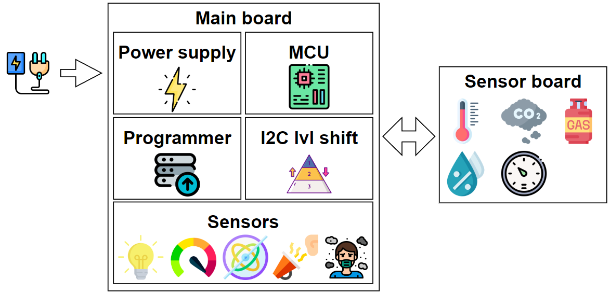

The system is powered by an external wall adapter. The two analog sensors ( sound and gas ) are interfaced through dedicated **MCP3221 I²C ADCs**, placed close to their outputs to minimize analog signal interference. This allows their measurements to be transferred to the ESP32 through the same digital communication architecture as the other sensors.

The sensors operate with different logic levels ( 1.8 V, 3.3 V, and 5 V ), while the ESP32 operates at 3.3 V. Two **PCA9517A I²C level shifters** are therefore used to interface the different voltage domains.


<!-- ------------------------------------------------------------------------------------------------------------------------------------------------------ -->
## Main board

**Figure: Main board functional block — power supply**

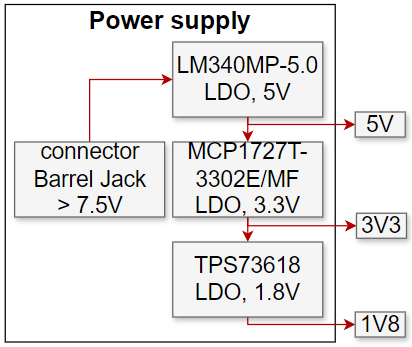

The device requires three voltage rails: **5 V, 3.3 V, and 1.8 V**.
Three LDOs are connected in a daisy-chain configuration to distribute the voltage drop and reduce power dissipation in the downstream regulators.

The main drawback is the power dissipated by the first LDO when converting the input voltage directly to 5 V, resulting in significant heat generation.

**Figure: Main board functional block — programmer**

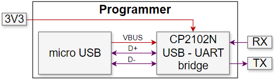

The ESP32 is programmed through **UART** using the CP2102N USB-UART bridge and a micro-USB connector.
The ESP32's integrated bootloader eliminates the need for a dedicated external programmer.

**Figure: Main board functional block — microcontroller**

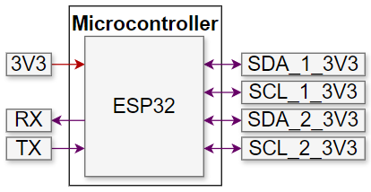

The sensors are distributed across the ESP32's **two independent I²C buses**.
The two analog sensors are interfaced through dedicated MCP3221 ADCs, providing an I²C interface to the ESP32.

Using separate buses improves system robustness. A malfunctioning sensor can hold the SDA line low and block its I²C bus; separating the sensors across two buses prevents a fault on one bus from affecting the remaining sensors.

**Figure: Main board functional block — level shifter**

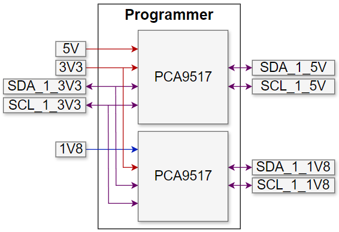

Two **PCA9517A I²C level shifters** are used to interface the ESP32's 3.3 V logic with sensors operating at **5 V and 1.8 V**.

**Figure: Main board functional block — sensors**

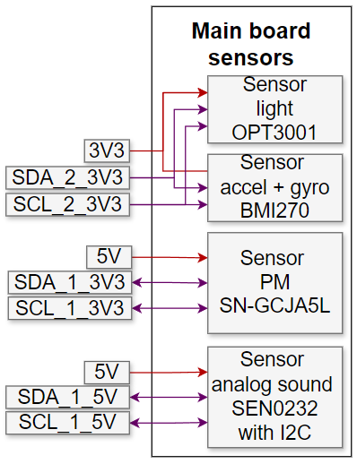

The **OPT3001 ambient light sensor** and **BMI270 6-axis IMU** are mounted directly on the main board.
The **SN-GCJA5L particulate matter sensor** and **SEN0232 sound sensor** are connected through external cables.

**Figure: Main board functional block — sound to I²C**

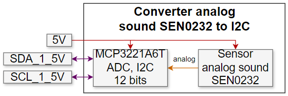

The analog output of the **SEN0232** is digitized locally by an **MCP3221 12-bit ADC**.
The resulting measurement is then transferred to the ESP32 through the I²C bus.


<!-- ------------------------------------------------------------------------------------------------------------------------------------------------------ -->
### Layout

**Figure: Main board layout**

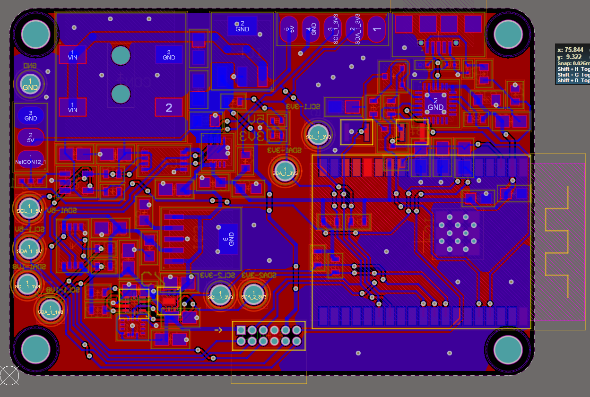

The ESP32 antenna is positioned outside the PCB to provide adequate clearance for wireless communication.
The MCP3221 used for the sound sensor is placed close to the input connector to minimize the length of the analog signal path.

The power distribution uses a **star topology**, while TVS protection devices are placed directly between the micro-USB connector and the CP2102N to improve ESD protection.

**Figure: Main board top and bottom views**

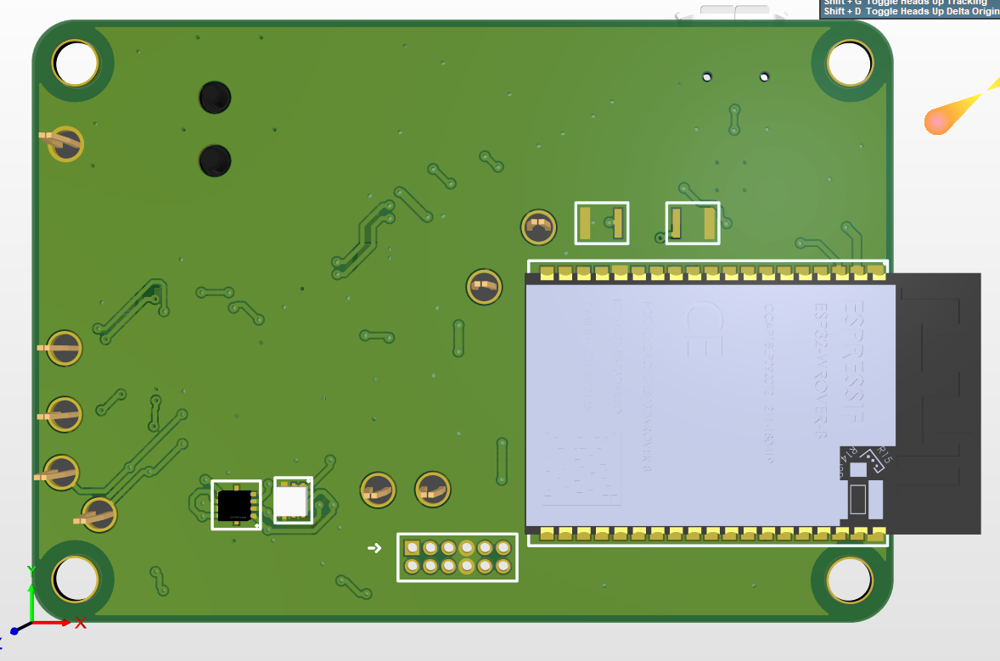

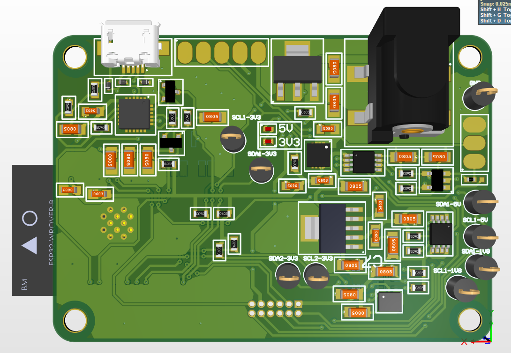

The PCB outline was designed to allow the sound sensor to be mounted directly above the main board, minimizing the overall device footprint.

All components except the **ESP32 and OPT3001** are mounted on the bottom side of the PCB.


<!-- ------------------------------------------------------------------------------------------------------------------------------------------------------ -->
## Sensor board

**Figure: Sensor board functional block — sensors**

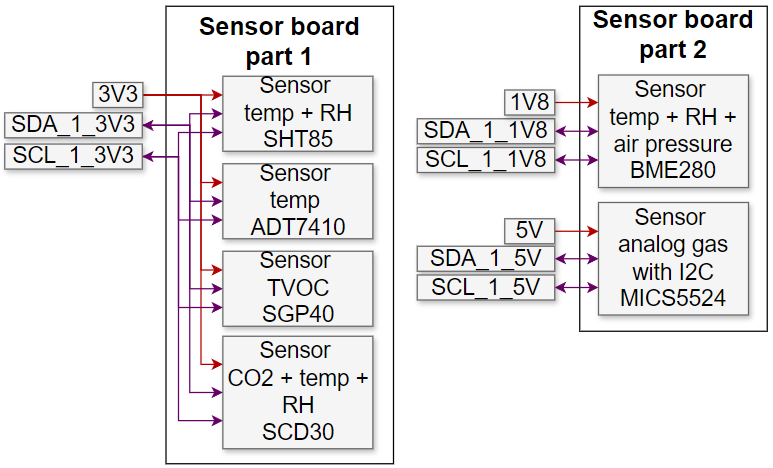

The sensors requiring direct exposure to the environment are mounted on the sensor board: **ADT7410, SHT85, BME280, SCD30, and SGP40**.

**Figure: Sensor board functional block — gas to I²C**

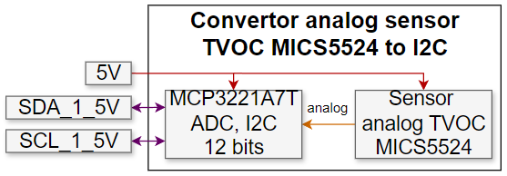

The analog output of the **MiCS-5524** is digitized locally using an **MCP3221 12-bit ADC**.
The resulting measurement is transferred to the ESP32 through the I²C bus.


<!-- ------------------------------------------------------------------------------------------------------------------------------------------------------ -->
### Layout

**Figure: Sensor board layout**

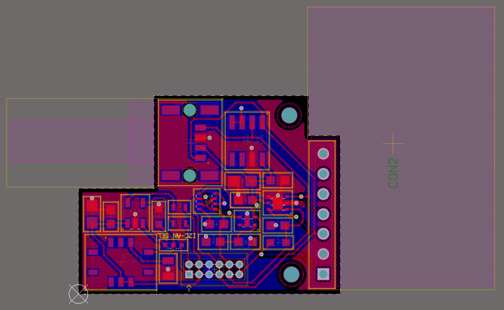

The sensor placement was optimized to **minimize the PCB width** while maintaining direct exposure of the sensing elements to the surrounding air.

**Figure: Sensor board top and bottom views**

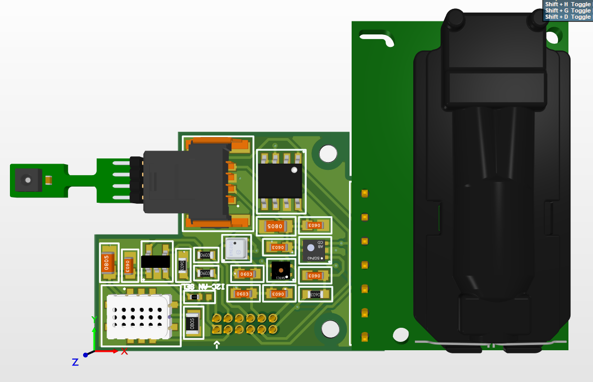

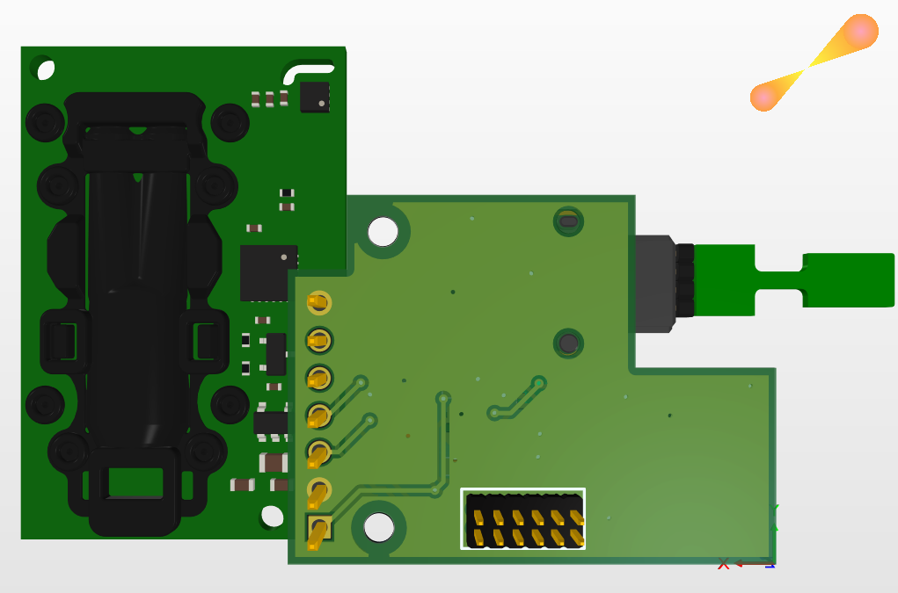

The sensor board is mechanically secured using **two mounting screws** and interfaces with the main board through the board-to-board headers.


<!-- ------------------------------------------------------------------------------------------------------------------------------------------------------ -->
## Final device

**Figure: Final device**


The sensor board is connected to the main board through two board-to-board headers, while the particulate matter and sound sensors are connected through external cables.

The assembly is secured using **four screws, four nuts, and four spacers**.
The board arrangement was designed to support integration into a future enclosure while maintaining access to the sensors requiring direct exposure to the environment.


<!-- ______________________________________________________________________________________________________________________________________________________ -->
# 💻 Software implementation

The firmware and software were designed with **scalability and modularity** in mind, allowing new sensors to be integrated with minimal changes to the existing codebase.
The software architecture also supports multiple monitoring devices communicating with the same backend.

<!-- ------------------------------------------------------------------------------------------------------------------------------------------------------ -->
## Microcontroller

The ESP32 firmware uses a **modular, object-oriented architecture** designed to simplify sensor integration and testing.
Common functionality is abstracted into base classes, while individual sensor implementations provide device-specific behavior.

The main classes are:

* **I2C_DRIVER** — handles I²C communication and bus-level error handling
* **SENSOR** — defines the common interface for all sensors
* **Sensor-specific classes** — implement device-specific initialization and measurement handling
* **MCP3221xxT** — provides the I²C interface to the MCP3221 ADCs used by the analog sensors

**Figure: I²C driver**

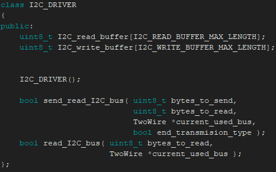

The **I2C_DRIVER** class provides a common interface for I²C communication.
Separate read and write buffers are used for data transfers, while the `end_of_transmission_type` parameter controls whether a repeated-start condition is generated after a write operation.

A **timeout mechanism** prevents an unresponsive sensor from blocking the I²C bus indefinitely.
The `send_read_I2C_bus()` and `read_I2C_bus()` functions return a status indicating whether the operation completed successfully.


**Figure: Sensor class**

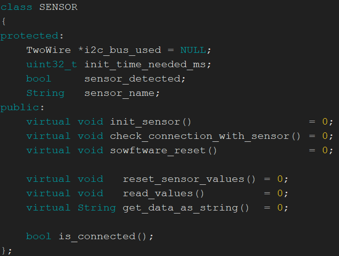

The **SENSOR** class defines the common interface shared by all sensor implementations.
Sensor-specific classes inherit from this interface and implement the required operations through pure virtual functions.

This abstraction allows the application to interact with different sensors through a **common interface**, while each implementation handles the communication and measurement details specific to its device.

**Figure: Sensor inheritance structure**

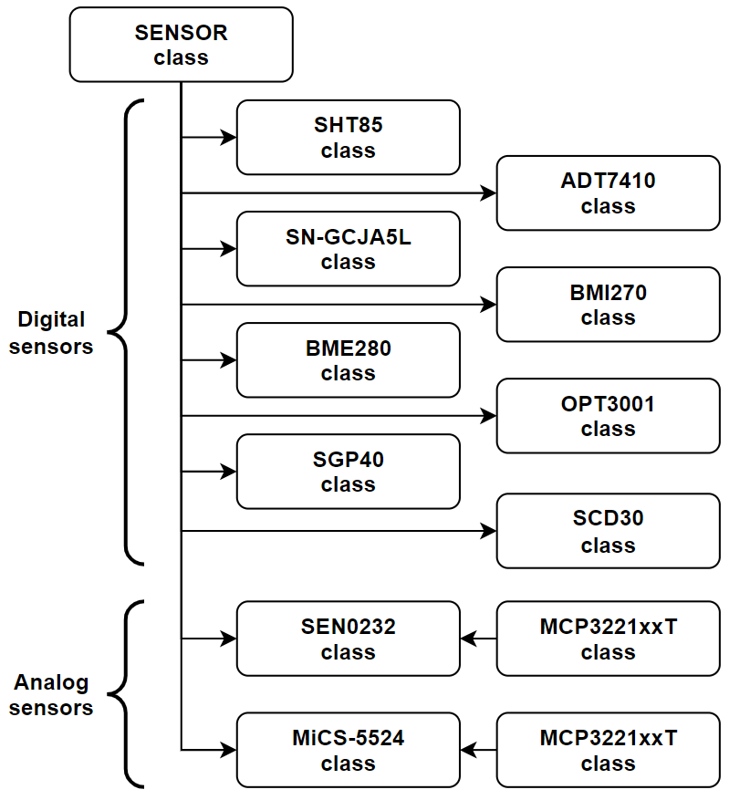

Digital sensors inherit directly from the **SENSOR** base class, while analog sensors inherit from both **SENSOR** and **MCP3221xxT**.
The latter provides the I²C ADC functionality required to interface the analog sensors with the ESP32.


<!-- ------------------------------------------------------------------------------------------------------------------------------------------------------ -->
## Dashboard

The dashboard provides a web-based interface for **visualizing and analyzing sensor data**.
The technology stack and implementation are described in the following sections.

<!-- ------------------------------------------------------------------------------------------------------------------------------------------------------ -->
### Node-RED

**Node-RED** was used to implement the web-based dashboard and data-processing layer.
Its flow-based architecture allows device communication, data processing, storage, and visualization to be connected as modular processing flows.

The dashboard uses standard Node-RED nodes for common functionality, while **JavaScript** is used for custom data processing and application logic.

The modular architecture simplifies the integration of **additional devices, sensor parameters, and processing functionality** without requiring major changes to the existing system.


<!-- ------------------------------------------------------------------------------------------------------------------------------------------------------ -->
### MQTT

Communication between the ESP32 and the dashboard is implemented using **MQTT** over TCP/IP.
MQTT provides a lightweight publish-subscribe communication model suitable for IoT applications.

**Figure: MQTT topology**

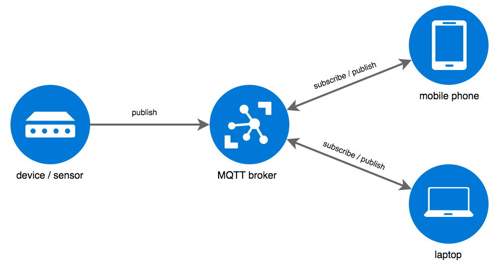

The system uses a **broker-based architecture** consisting of MQTT clients and a central broker:

* **MQTT client** — publishes and/or subscribes to messages. The ESP32 and dashboard backend act as clients.
* **MQTT broker** — receives published messages and distributes them to clients subscribed to the corresponding topics.

The ESP32 publishes sensor measurements to dedicated MQTT topics, while the dashboard backend subscribes to these topics for data processing, storage, and visualization.

The publish-subscribe model **decouples the data producer from its consumers**, allowing additional clients to consume the sensor data without requiring changes to the ESP32 firmware.


<!-- ------------------------------------------------------------------------------------------------------------------------------------------------------ -->
### Final dashboard

The MQTT broker and Node-RED application are hosted on a **Raspberry Pi**.
Acquired sensor data is stored in a **CSV file**, providing persistent local storage for subsequent analysis and extraction.

Users can extract measurements either by selecting a specific time interval or by downloading the complete dataset.

**Figure: Dashboard final interface**

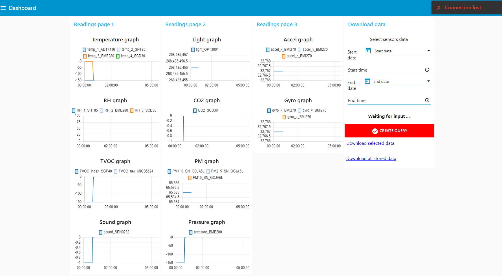

The interface is organized into four columns: three for displaying sensor measurements and one for data extraction.

Sensor measurements are grouped by parameter type, allowing users to monitor the acquired data in real time and select specific datasets for further processing.


<!-- ______________________________________________________________________________________________________________________________________________________ -->
# 🔥 Demo

A demonstration video showcasing the device's measurement, monitoring, and data-extraction functionality is available below.

* **Temperature, CO₂, ambient light, and sound measurement, followed by data extraction:** [Demo video](https://drive.google.com/file/d/1O22NpwT8j0dOTAGnGvBCRcS-pP-F0plG/view?usp=sharing)

> [!NOTE]
> The video is hosted on Google Drive. Browser playback may have reduced quality; downloading the video is recommended for the best viewing experience.

A temperature offset can be observed between the sensors due to heat generated by the **5 V LDO** and the sensor's placement on the sensor board.


<!-- ______________________________________________________________________________________________________________________________________________________ -->
# 🥳 Results and limitations

The project successfully demonstrated the integration of multiple environmental sensors into a custom hardware and software platform, with measurements acquired by the ESP32, transmitted over MQTT, stored, visualized, and exported through the dashboard.

Several limitations were identified during development:

* **Measurement validation:** Sensor datasheet specifications apply under defined test conditions and do not guarantee the same accuracy after integration into the complete system. Proper validation would require comparison against **calibrated reference instruments** under controlled conditions.
* **Power dissipation:** The 5 V LDO generates significant heat due to the voltage drop from the input supply. A **buck converter placed before the LDOs** could reduce the voltage drop and power dissipation. The same approach could be applied to the 3.3 V and 1.8 V supply rails.
* **Dashboard performance:** Short sampling intervals result in frequent graph updates, increasing the dashboard's processing and rendering load. Performance could be improved through more efficient data handling, reduced update frequency, or a more optimized visualization solution.

These limitations provide clear directions for further development and optimization of the system.


<!-- ______________________________________________________________________________________________________________________________________________________ -->
# 🏁 Conclusions

The project successfully delivered a **custom embedded hardware and software platform for multi-parameter air quality monitoring**.

The system integrates multiple sensors, custom PCBs, ESP32 firmware, MQTT communication, data storage, and a web-based dashboard for **real-time visualization and historical data analysis**.

The modular hardware and software architecture allows additional sensors, devices, and processing features to be integrated with minimal changes, providing a solid foundation for future development and system expansion.


<!-- ______________________________________________________________________________________________________________________________________________________ -->
# 🔎 Resources

Hardware resources:

* [ESP32-WROVER-B datasheet](https://www.espressif.com/sites/default/files/documentation/esp32-wrover-b_datasheet_en.pdf) — Espressif Systems
* [ADT7410 datasheet](https://ro.mouser.com/datasheet/2/609/ADT7410-1503456.pdf) — Analog Devices
* [SHT85 datasheet](https://www.mouser.com/datasheet/2/682/Sensirion_Humidity_Sensors_SHT85_Datasheet-1501398.pdf) — Sensirion
* [SEN0232 datasheet](https://www.mouser.de/pdfdocs/SEN0232_Web.pdf) — DFRobot
* [SCD30 datasheet](https://www.mouser.com/datasheet/2/682/Sensirion_CO2_Sensors_SCD30_Datasheet-1901872.pdf) — Sensirion
* [OPT3001 datasheet](https://www.ti.com/lit/ds/symlink/opt3001.pdf?ts=1630915821822) — Texas Instruments
* [SGP40 datasheet](https://ro.mouser.com/datasheet/2/682/Sensirion_Gas_Sensors_Datasheet_SGP40-2001008.pdf) — Sensirion
* [MiCS-5524 datasheet](https://cdn-shop.adafruit.com/product-files/3199/MiCS-5524.pdf) — SGX Sensortech
* [SN-GCJA5L datasheet](https://www.mouser.com/catalog/specsheets/Panasonic_SN-GCJA5%20Data%20Sheet.pdf) — Panasonic
* [BMI270 datasheet](https://download.mikroe.com/documents/datasheets/bst-bmi270-ds000-2_datasheet.pdf) — Bosch Sensortec
* [BME280 datasheet](https://www.mouser.com/datasheet/2/783/BST-BME280-DS002-1509607.pdf) — Bosch Sensortec
* [CP2102N datasheet](https://www.silabs.com/documents/public/data-sheets/cp2102n-datasheet.pdf) — Silicon Labs
* [PCA9517A datasheet](https://www.farnell.com/datasheets/2578416.pdf) — ON Semiconductor
* [MCP3221 datasheet](https://ro.mouser.com/datasheet/2/268/mchp_s_a0002844534_1-2274805.pdf) — Microchip

Software resources:

* [Node-RED Dashboard](https://flows.nodered.org/node/node-red-dashboard) — Node-RED

<!-- ______________________________________________________________________________________________________________________________________________________ -->
# ❓ Glossary

* **ADC** — Analog-to-Digital Converter
* **GUI** — Graphical User Interface
* **I²C** — Inter-Integrated Circuit
* **IMU** — Inertial Measurement Unit
* **LDO** — Low-Dropout Regulator
* **MQTT** — Message Queuing Telemetry Transport
* **OOP** — Object-Oriented Programming
* **PCB** — Printed Circuit Board
* **PM** — Particulate Matter
* **PTFE** — Polytetrafluoroethylene
* **SAR** — Successive Approximation Register
* **SMBus** — System Management Bus
* **SPI** — Serial Peripheral Interface
* **TVOC** — Total Volatile Organic Compounds
* **UART** — Universal Asynchronous Receiver/Transmitter
* **USB** — Universal Serial Bus
* **VOC** — Volatile Organic Compounds