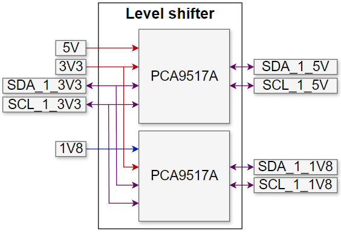

<div align="center">
     
    <h1>Air quality monitoring system ( documentation in progress )</h1>
</div>


<!-- ______________________________________________________________________________________________________________________________________________________ INTRODUCTION -->
# :rocket: Introduction


<!-- ______________________________________________________________________________________________________________________________________________________ TABLE OF CONTENT -->
# :ledger:Table of content

- [:rocket: Introduction](#rocket-introduction)
- [:ledger:Table of content](#ledgertable-of-content)
- [:page\_facing\_up: About the project](#page_facing_up-about-the-project)
  - [Programs used](#programs-used)
  - [File structure](#file-structure)
- [:gear: Components](#gear-components)
  - [ESP32-­WROVER­-B](#esp32-wrover-b)
  - [ADT7410](#adt7410)
  - [SHT85](#sht85)
  - [SEN0232](#sen0232)
  - [SCD30](#scd30)
  - [OPT3001](#opt3001)
  - [SGP40](#sgp40)
  - [MICS5524](#mics5524)
  - [SN-GCJA5L](#sn-gcja5l)
  - [BMI270](#bmi270)
  - [BME280](#bme280)
  - [CP2102N](#cp2102n)
  - [PCA9517A](#pca9517a)
  - [MCP3221](#mcp3221)
- [Hardware implementation](#hardware-implementation)
  - [Device architecture](#device-architecture)
  - [Main board](#main-board)
  - [Sensor board](#sensor-board)
  - [Final device](#final-device)
- [Software implementation](#software-implementation)
  - [Microcontroller](#microcontroller)
  - [Dashboard](#dashboard)
- [:partying\_face: Results](#partying_face-results)
- [:fire: Demo](#fire-demo)
- [:star2: Future work](#star2-future-work)
- [:checkered\_flag: Conclusions](#checkered_flag-conclusions)
- [:mag\_right: Resources](#mag_right-resources)
- [:question: Glossary](#question-glossary)


<!-- ______________________________________________________________________________________________________________________________________________________ ABOUT THE PROJECT -->
# :page_facing_up: About the project


The device must monitor the following parameters:
1. temperature
2. humidity
3. air pressure
4. CO2 quantity
5. PM particles density
6. TVOC
7. luminosity
8. acceleration and gyro
 
A customized device was developed to achieve the previously mentioned objectives.

The acronyms used during the device presentation can be found in the [Glossary](#mag_right-glossary) section.

<!-- ------------------------------------------------------------------------------------------------------------------------------------------------------ PROGRAMS USED -->
## Programs used

Multiple tools were utilized during the development of the project, and they are listed below:
+ Altium Designer: schematic and PCB designing
+ Arduino: embedded programming

A logic analyzer was used for low level debugging.


<!-- ------------------------------------------------------------------------------------------------------------------------------------------------------ FILE STRUCTURE -->
## File structure

The file structure of the project can be seen in the following figure:
```
.
├── docs
│   └── images ( photos used in README )
└── README.md
```

<!-- </details> -->

<!-- ______________________________________________________________________________________________________________________________________________________ COMPONENTS -->
# :gear: Components
    
In this section, the components used to implement the device will be presented. 
At first, the component list will be shown, after which the most important capabilities of the main components will be detailed.

The following list contains the components needed to build the device:
+ main components
    + 1x ESP32-­WROVER­-B microcontroller
        + [ Link datasheet ESP32-­WROVER­-B ]( https://www.espressif.com/sites/default/files/documentation/esp32-wrover-b_datasheet_en.pdf )
    + 1x ADT7410 temperature sensor
        + [ Link datasheet ADT7410 ]( https://ro.mouser.com/datasheet/2/609/ADT7410-1503456.pdf )
    + 1x SHT85 temperature and humidity sensor
        + [ Link datasheet SHT85 ]( https://www.mouser.com/datasheet/2/682/Sensirion_Humidity_Sensors_SHT85_Datasheet-1501398.pdf )
    + 1x SEN0232 sound level sensor
        + [ Link datasheet SEN0232 ]( https://www.mouser.de/pdfdocs/SEN0232_Web.pdf )
    + 1x SCD30 CO2, humidity, and temperature sensor
        + [ Link datasheet SCD30 ]( https://www.mouser.com/datasheet/2/682/Sensirion_CO2_Sensors_SCD30_Datasheet-1901872.pdf )
    + 1x OPT3001 ambient light sensor
        + [ Link datasheet OPT3001 ]( https://www.ti.com/lit/ds/symlink/opt3001.pdf?ts=1630915821822 )
    + 1x SGP40 TVOC sensor
        + [ Link datasheet SGP40 ]( https://ro.mouser.com/datasheet/2/682/Sensirion_Gas_Sensors_Datasheet_SGP40-2001008.pdf )
    + 1x MICS5524 TVOC analog sensor
        + [ Link datasheet MICS5524 ]( https://cdn-shop.adafruit.com/product-files/3199/MiCS-5524.pdf )
    + 1x SN-GCJA5L PM particles sensor
        + [ Link datasheet SN-GCJA5L ]( https://www.mouser.com/catalog/specsheets/Panasonic_SN-GCJA5%20Data%20Sheet.pdf )
    + 1x BMI270 6 axes IMU sensor
        + [ Link datasheet BMI270 ]( https://download.mikroe.com/documents/datasheets/bst-bmi270-ds000-2_datasheet.pdf )
    + 1x BME280 humidity and temperature sensor
        + [ Link datasheet BME280 ]( https://www.mouser.com/datasheet/2/783/BST-BME280-DS002-1509607.pdf )
    + 1x CP2102N USB-UART bridge
        + [ Link datasheet CP2102N ]( https://www.silabs.com/documents/public/data-sheets/cp2102n-datasheet.pdf )
    + 1x PCA9517A level shifter I2C bus repeater
        + [ Link datasheet PCA9517A ]( https://www.farnell.com/datasheets/2578416.pdf )
    + 1x MCP3221 external 12-bits ADC
        + [ Link datasheet MCP3221 ]( https://ro.mouser.com/datasheet/2/268/mchp_s_a0002844534_1-2274805.pdf )
+ auxiliary components
    + 1x barrel jack connector and wall adapter
    + 4x M3x30 screws, 4x M3 nuts and 4x spacers
    + multiple male and female headers, cables & test points


<!-- ------------------------------------------------------------------------------------------------------------------------------------------------------ ESP32-­WROVER­-B -->
## ESP32-­WROVER­-B
[ ESP32-­WROVER­-B ]( https://www.espressif.com/sites/default/files/documentation/esp32-wrover-b_datasheet_en.pdf )


<!-- ------------------------------------------------------------------------------------------------------------------------------------------------------ ADT7410 -->
## ADT7410
[ ADT7410 ]( https://ro.mouser.com/datasheet/2/609/ADT7410-1503456.pdf )


<!-- ------------------------------------------------------------------------------------------------------------------------------------------------------ SHT85-->
## SHT85
[ SHT85 ]( https://www.mouser.com/datasheet/2/682/Sensirion_Humidity_Sensors_SHT85_Datasheet-1501398.pdf )

<!-- ------------------------------------------------------------------------------------------------------------------------------------------------------ SEN0232 -->
## SEN0232
[ SEN0232 ]( https://www.mouser.de/pdfdocs/SEN0232_Web.pdf )


<!-- ------------------------------------------------------------------------------------------------------------------------------------------------------ SCD30 -->
## SCD30
[ SCD30 ]( https://www.mouser.com/datasheet/2/682/Sensirion_CO2_Sensors_SCD30_Datasheet-1901872.pdf )


<!-- ------------------------------------------------------------------------------------------------------------------------------------------------------ OPT3001 -->
## OPT3001
[ OPT3001 ]( https://www.ti.com/lit/ds/symlink/opt3001.pdf?ts=1630915821822 )


<!-- ------------------------------------------------------------------------------------------------------------------------------------------------------ SGP40 -->
## SGP40
[ Link datasheet SGP40 ]( https://ro.mouser.com/datasheet/2/682/Sensirion_Gas_Sensors_Datasheet_SGP40-2001008.pdf )

<!-- ------------------------------------------------------------------------------------------------------------------------------------------------------ MICS5524 -->
## MICS5524
[ MICS5524 ]( https://cdn-shop.adafruit.com/product-files/3199/MiCS-5524.pdf )


<!-- ------------------------------------------------------------------------------------------------------------------------------------------------------ SN-GCJA5L -->
## SN-GCJA5L
[ SN-GCJA5L ]( https://www.mouser.com/catalog/specsheets/Panasonic_SN-GCJA5%20Data%20Sheet.pdf )


<!-- ------------------------------------------------------------------------------------------------------------------------------------------------------ BMI270 -->
## BMI270
[ BMI270 ]( https://download.mikroe.com/documents/datasheets/bst-bmi270-ds000-2_datasheet.pdf )


<!-- ------------------------------------------------------------------------------------------------------------------------------------------------------ BME280 -->
## BME280
[ BME280 ]( https://www.mouser.com/datasheet/2/783/BST-BME280-DS002-1509607.pdf )


<!-- ------------------------------------------------------------------------------------------------------------------------------------------------------ CP2102N -->
## CP2102N
[ CP2102N ]( https://www.silabs.com/documents/public/data-sheets/cp2102n-datasheet.pdf )


<!-- ------------------------------------------------------------------------------------------------------------------------------------------------------ PCA9517A -->
## PCA9517A
[ PCA9517A ]( https://www.farnell.com/datasheets/2578416.pdf )


<!-- ------------------------------------------------------------------------------------------------------------------------------------------------------ MCP3221 -->
## MCP3221
[ MCP3221 ]( https://ro.mouser.com/datasheet/2/268/mchp_s_a0002844534_1-2274805.pdf )


# Hardware implementation

In this section, the hardware implementation of the device will be detailed.

For each board, the block diagrams will be presented first, where the connections between the components can be seen. 
To represent the functionality which they fulfill, the following colors were used:

- ${\textsf{\color{red}red}}$ and ${\textsf{\color{blue}blue}}$ - DC power supply
- ${\textsf{\color{orange}orange}}$ - analog signals
- ${\textsf{\color{purple}purple}}$ - digital signals

After the block diagram, the schematics will be shown, where the main reasons behind the choices made will be explained. 
The layout and the assembled boards will be presented at the end.


## Device architecture


The functionality of the device was divided into 2 PCBs, as follows:

- **Board P1 ( Main board )**: supplies the voltage level needed by the components; the ESP32 and the sensors which don't need direct contact with the air ( light, accel + gyro, sound ) are placed on this board; the PM particle sensor connects to this bard using a header
- **Board P2 ( Sensor board )**: the sensors which need direct contact with the air ( temperature, humidity, CO2, TVOC, air pressure ) are placed on this board

The architecture of the entire system can be seen in the figure below. 

**FIGURE 3: Device architecture**


## Main board





## Sensor board


## Final device


# Software implementation

## Microcontroller


## Dashboard


<!-- ______________________________________________________________________________________________________________________________________________________ RESULTS -->
# :partying_face: Results

<!-- ______________________________________________________________________________________________________________________________________________________ DEMO -->
# :fire: Demo

<!-- ______________________________________________________________________________________________________________________________________________________ FUTURE WORK -->
# :star2: Future work


<!-- ______________________________________________________________________________________________________________________________________________________ CONCLUSION -->
# :checkered_flag: Conclusions


<!-- ______________________________________________________________________________________________________________________________________________________ RESOURCES -->
# :mag_right: Resources


<!-- ______________________________________________________________________________________________________________________________________________________ GLOSSARY -->
# :question: Glossary

