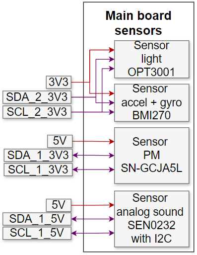
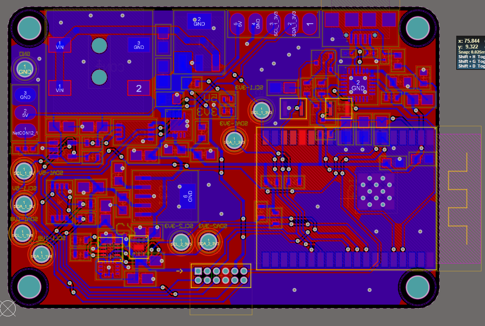
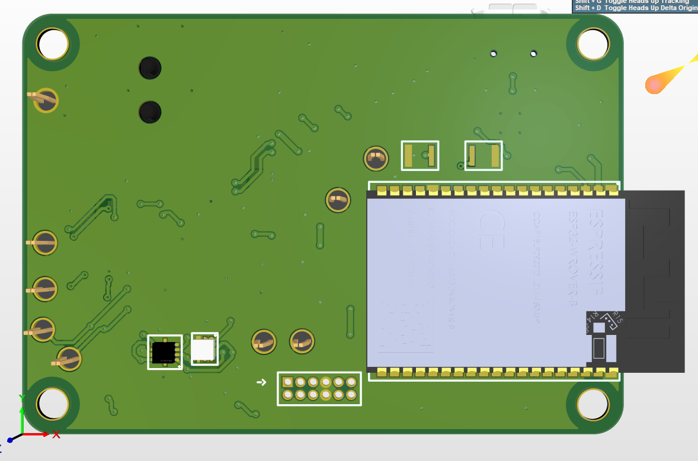
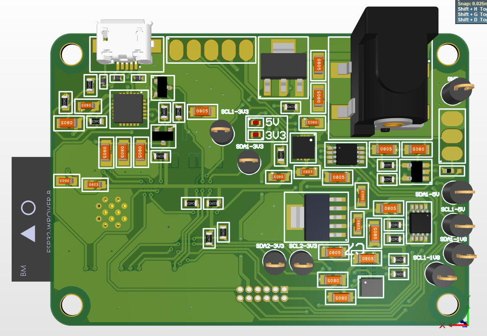
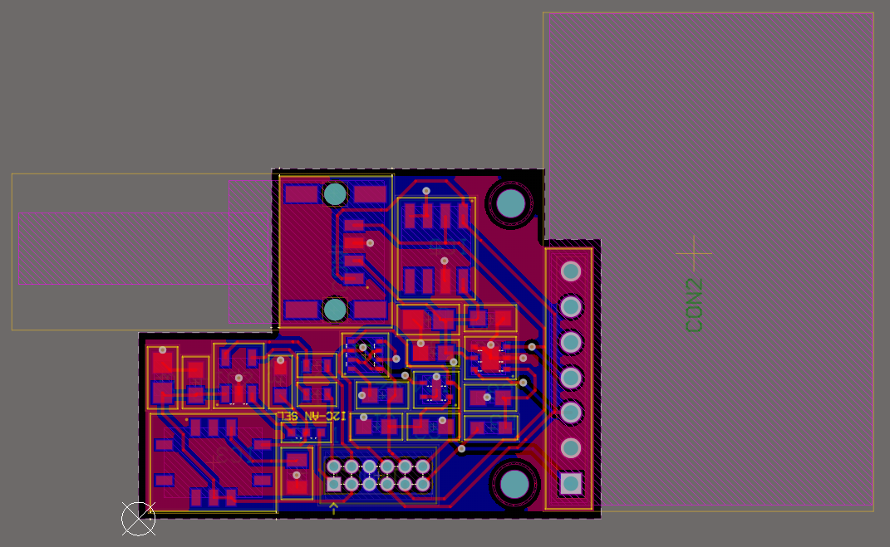
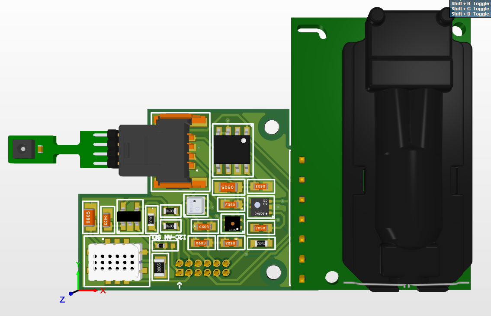
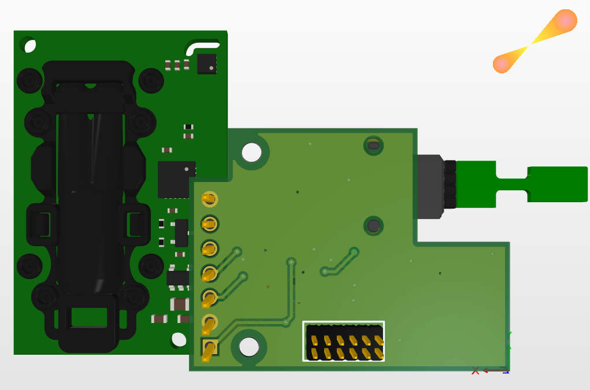
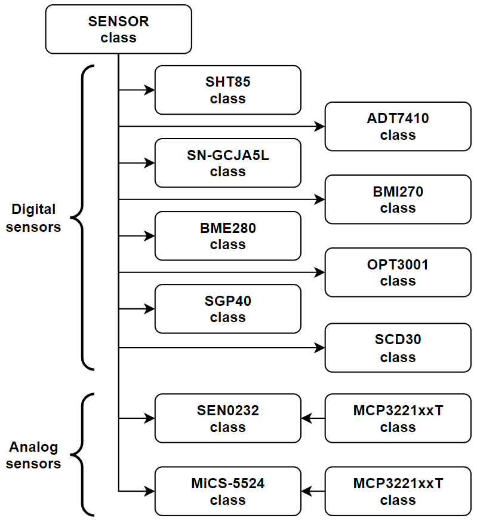
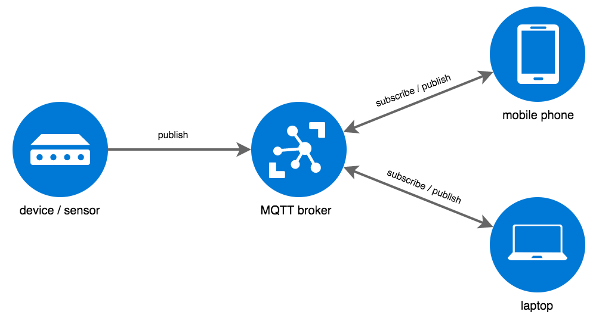

<div align="center">
     
    <h1>Air quality monitoring system</h1>
</div>


<!-- ______________________________________________________________________________________________________________________________________________________ INTRODUCTION -->
# :rocket: Introduction

Air quality is a global issue, both short and long term exposure to air pollution can cause a range of health issues, including respiratory diseases, heart disease, cognitive deficits, and more. 
Improving air quality not only helps prevent these health issues but also boosts productivity levels.

The aim of this project is to develop a custom hardware and software solution for monitoring multiple air quality parameters. 
The system will provide real-time data to users, enabling them to assess air quality and make informed decisions.

A video was recorded to showcase part of the device's functionality, and it can be viewed in the [:fire: Demo](#fire-demo) section. 
Multiple photos of the system can be seen in the [Hardware part 1](#layout), [Hardware part 2](#layout-1) and [Website](#website) sections.


<!-- ______________________________________________________________________________________________________________________________________________________ TABLE OF CONTENT -->
# :ledger:Table of content

- [:rocket: Introduction](#rocket-introduction)
- [:ledger:Table of content](#ledgertable-of-content)
- [:page\_facing\_up: About the project](#page_facing_up-about-the-project)
  - [Programs used](#programs-used)
  - [File structure](#file-structure)
- [:gear: Components](#gear-components)
  - [ESP32-­WROVER­-IB](#esp32-wrover-ib)
  - [ADT7410](#adt7410)
  - [SHT85](#sht85)
  - [SEN0232](#sen0232)
  - [OPT3001](#opt3001)
  - [MiCS-5524](#mics-5524)
  - [SN-GCJA5L](#sn-gcja5l)
  - [SGP40](#sgp40)
  - [BMI270](#bmi270)
  - [BME280](#bme280)
  - [SCD30](#scd30)
  - [CP2102N](#cp2102n)
  - [PCA9517A](#pca9517a)
  - [MCP3221](#mcp3221)
- [Hardware implementation](#hardware-implementation)
  - [Device architecture](#device-architecture)
  - [Main board](#main-board)
    - [Layout](#layout)
  - [Sensor board](#sensor-board)
    - [Layout](#layout-1)
  - [Final device](#final-device)
- [Software implementation](#software-implementation)
  - [Microcontroller](#microcontroller)
  - [Dashboard](#dashboard)
    - [Node-RED](#node-red)
    - [MQTT](#mqtt)
    - [Website](#website)
- [:fire: Demo](#fire-demo)
- [:partying\_face: Results](#partying_face-results)
- [:checkered\_flag: Conclusions](#checkered_flag-conclusions)
- [:mag\_right: Resources](#mag_right-resources)
- [:question: Glossary](#question-glossary)


<!-- ______________________________________________________________________________________________________________________________________________________ ABOUT THE PROJECT -->
# :page_facing_up: About the project

The following parameters must be monitored:
1. temperature
2. humidity
3. air pressure
4. CO2 concentration
5. PM particles density
6. TVOC
7. luminosity
8. acceleration
9. angular acceleration

A customized device was developed to integrate multiple sensors for tracking these parameters.

The device is split into two PCBs, based on their functionality. 
The sensor board contains the sensors that need direct contact with the air, and the main board accommodates the rest of the components.
This design protects the components on the main board from external environmental factors.

The microcontroller periodically reads the sensor data and sends it to a server via WiFi using the MQTT protocol, where the data is stored. 
The user can interact with the archived data using a website created using Node-RED. 
From there, users can view the data and execute various queries to extract data sets for further processing, such as applying different filters on them.


The acronyms used during the device presentation can be found in the [Glossary](#mag_right-glossary) section, and the resources in the [Resources](#mag_right-resources) section.


<!-- ------------------------------------------------------------------------------------------------------------------------------------------------------ PROGRAMS USED -->
## Programs used

Multiple tools were utilized during the development of the project, and they are listed below:
+ Altium Designer: schematic and PCB designing
+ Arduino: embedded programming

A logic analyzer was used for low level debugging.


<!-- ------------------------------------------------------------------------------------------------------------------------------------------------------ FILE STRUCTURE -->
## File structure

The file structure of the project can be seen in the following figure:
```
.
├── docs
│   └── images ( photos used in README )
└── README.md
```

<!-- </details> -->

<!-- ______________________________________________________________________________________________________________________________________________________ COMPONENTS -->
# :gear: Components
    
In this section, the components used to implement the device will be presented. 
At first, the component list will be shown, after which the most important capabilities of the main components will be detailed.

The following list contains the components needed to build the device:
+ main components
    + 1x ESP32-­WROVER­-B microcontroller
        + [ Link datasheet ESP32-­WROVER­-B ]( https://www.espressif.com/sites/default/files/documentation/esp32-wrover-b_datasheet_en.pdf )
    + 1x ADT7410 temperature sensor
        + [ Link datasheet ADT7410 ]( https://ro.mouser.com/datasheet/2/609/ADT7410-1503456.pdf )
    + 1x SHT85 temperature and humidity sensor
        + [ Link datasheet SHT85 ]( https://www.mouser.com/datasheet/2/682/Sensirion_Humidity_Sensors_SHT85_Datasheet-1501398.pdf )
    + 1x SEN0232 sound level sensor
        + [ Link datasheet SEN0232 ]( https://www.mouser.de/pdfdocs/SEN0232_Web.pdf )
    + 1x SCD30 CO2, humidity, and temperature sensor
        + [ Link datasheet SCD30 ]( https://www.mouser.com/datasheet/2/682/Sensirion_CO2_Sensors_SCD30_Datasheet-1901872.pdf )
    + 1x OPT3001 ambient light sensor
        + [ Link datasheet OPT3001 ]( https://www.ti.com/lit/ds/symlink/opt3001.pdf?ts=1630915821822 )
    + 1x SGP40 TVOC sensor
        + [ Link datasheet SGP40 ]( https://ro.mouser.com/datasheet/2/682/Sensirion_Gas_Sensors_Datasheet_SGP40-2001008.pdf )
    + 1x MiCS-5524 TVOC analog sensor
        + [ Link datasheet MiCS-5524 ]( https://cdn-shop.adafruit.com/product-files/3199/MiCS-5524.pdf )
    + 1x SN-GCJA5L PM particles sensor
        + [ Link datasheet SN-GCJA5L ]( https://www.mouser.com/catalog/specsheets/Panasonic_SN-GCJA5%20Data%20Sheet.pdf )
    + 1x BMI270 6 axes IMU sensor
        + [ Link datasheet BMI270 ]( https://download.mikroe.com/documents/datasheets/bst-bmi270-ds000-2_datasheet.pdf )
    + 1x BME280 pressure, humidity and temperature sensor
        + [ Link datasheet BME280 ]( https://www.mouser.com/datasheet/2/783/BST-BME280-DS002-1509607.pdf )
    + 1x CP2102N USB-UART bridge
        + [ Link datasheet CP2102N ]( https://www.silabs.com/documents/public/data-sheets/cp2102n-datasheet.pdf )
    + 1x PCA9517A level shifter I2C bus repeater
        + [ Link datasheet PCA9517A ]( https://www.farnell.com/datasheets/2578416.pdf )
    + 1x MCP3221 external 12-bits ADC
        + [ Link datasheet MCP3221 ]( https://ro.mouser.com/datasheet/2/268/mchp_s_a0002844534_1-2274805.pdf )
+ auxiliary components
    + 1x barrel jack connector and wall adapter
    + 4x M3x30 screws and 4x spacers
    + multiple male and female headers, cables & test points


<!-- ------------------------------------------------------------------------------------------------------------------------------------------------------ ESP32-­WROVER­-IB -->
## ESP32-­WROVER­-IB

**FIGURE 1: ESP32-­WROVER­-IB module**


The microcontroller chosen to be used is the [ ESP32-­WROVER­-IB ]( https://www.espressif.com/sites/default/files/documentation/esp32-wrover-b_datasheet_en.pdf ) module from Espressif.
The resources available on the Internet, more precisely examples and various libraries, make it a perfect choice for IoT applications.


**FIGURE 2: ESP32 functional blocks**


The module features integrated wireless communication, including Wi-Fi. 
It also supports typical intraboard serial communication protocols such as SPI, I2C, and UART. 
The power of the antenna used for data transmission can be adjusted depending on its position in relation to the router, which helps achieve lower energy consumption. 
Its minimalist design takes up little space, making it easy to integrate into the device.


<!-- ------------------------------------------------------------------------------------------------------------------------------------------------------ ADT7410 -->
## ADT7410

The [ ADT7410 ]( https://ro.mouser.com/datasheet/2/609/ADT7410-1503456.pdf ) is a high accuracy **temperature sensor**, capable of measuring temperatures between −55 °C and +150 °C. 
Its accuracy ranges from ±0.4°C to ±1.0°C, depending on the measurement range and supply voltage. 
The resolution of the ADC can be selected between 13 and 16 bits ( sign + 12 or 15 data bits ).
Alerts such as overtemperature, undertemperature, and critical overtemperature can be configured using the INT and CT pins, with programmable limit settings. 
The INT pin can operate in either interrupt mode or comparator mode.

The sensor communicates via the I2C protocol, supporting speeds of up to 400 kHz.
The last two I2C address bits are configurable through the A0 and A1 pins, allowing for four possible address variations. 
It operates at a supply voltage range of 2.7V to 5.5V.


<!-- ------------------------------------------------------------------------------------------------------------------------------------------------------ SHT85-->
## SHT85

The [ SHT85 ]( https://www.mouser.com/datasheet/2/682/Sensirion_Humidity_Sensors_SHT85_Datasheet-1501398.pdf ) is a very high accuracy **humidity and temperature sensor**.
Its measurement ranges are [ 0, 100 ] %RH for humidity and [ -40, 105 ] °C for temperature, with a typical accuracy of ±1.5% RH ( over the range [ 0, 80 ] %RH ) and ±0.1°C ( for the range [ 20, 50 ] °C ). 
The package design ensures the best possible thermal coupling to the environment and decoupling from potential heat sources on the main board. 
It features a PTFE membrane that protects the sensor opening from liquids and dust according to the IP67 standard, without affecting the response time of the RH signal. 
This makes it suitable for use in harsh environmental conditions.
Additionally, data and commands are protected with an 8-bit CRC checksum, which increases communication reliability.

The sensor uses the I2C protocol, supporting speeds up to 1 MHz and a single I2C address.
It operates at voltages ranging from 2.15V to 5.5V, with a typical operating voltage of 3.3V.


<!-- ------------------------------------------------------------------------------------------------------------------------------------------------------ SEN0232 -->
## SEN0232

The [ SEN0232 ]( https://www.mouser.de/pdfdocs/SEN0232_Web.pdf ) is a plug and play **sound level meter** board.
Its measurement range is 30 dBA to 150 dBA, with a measurement error of ±1.5 dB. 
An important aspect is that the A-weighted decibel ( dBA ) is an expression of the relative loudness of sounds as perceived by the human ear, meaning the sound level is normalized to human hearing. 
The sensor's output is an analog signal ranging from 0.6V to 2.6V.

It can operate on either 3.3V or 5V voltage levels.


<!-- ------------------------------------------------------------------------------------------------------------------------------------------------------ OPT3001 -->
## OPT3001

The [ OPT3001 ]( https://www.ti.com/lit/ds/symlink/opt3001.pdf?ts=1630915821822 ) is an **ambient light sensor** capable of measuring values between 0.01 lux and 83 klux. 
The spectral response of the sensor closely matches the photopic response of the human eye and includes significant infrared rejection, typically rejecting over 99% of IR. 
This strong IR rejection also helps maintain high accuracy when mounting the sensor under dark glass. 
Additionally, the effects of 50-Hz and 60-Hz noise from typical light bulbs are minimized by integrating the results over either 100 ms or 800 ms. 
Interrupts can be generated using the INT pin by comparing the measurement results to programmable low and high limit values.

The sensor uses the I2C protocol, with speeds of up to 2.6 MHz. 
There are four possible I2C addresses, selectable via the ADDR pin by connecting it to GND, VDD, SDA, or SCL. 
Its operating voltage is 3.3V.


<!-- ------------------------------------------------------------------------------------------------------------------------------------------------------ MICS5524 -->
## MiCS-5524

The [ MiCS-5524 ]( https://cdn-shop.adafruit.com/product-files/3199/MiCS-5524.pdf ) is an **indoor gas detector** for carbon monoxide and natural gas leakages.
The sensor can detect multiple gases, namely carbon monoxide ( CO ), ethanol ( C2H6OH ), hydrogen ( H2 ), ammonia ( NH3 ) and methane ( CH4 ), at various concentrations. 
However, it cannot distinguish which specific gas is being detected.

The sensor is essentially composed of a heater and an external resistor. 
The voltage across the external resistor can then be measured by an ADC. 
The operating voltage of the sensor is 5V.


<!-- ------------------------------------------------------------------------------------------------------------------------------------------------------ SN-GCJA5L -->
## SN-GCJA5L

The [ SN-GCJA5L ]( https://www.mouser.com/catalog/specsheets/Panasonic_SN-GCJA5%20Data%20Sheet.pdf ) is a laser type **PM sensor**.
The accuracy of the sensor is ±10% across low to high concentrations. 
The sensor detects particles using an optical method, with a laser diode as the light-emitting device and a photodiode as the light-receiving device. 
The laser diode emits light, while the photodiode detects scattered light, which is correlated to the actual floating particles in the air. 
A microprocessor inside the sensor analyzes the wave profile from the photodiode using a special algorithm, then outputs a converted mass-density.

It provides two digital interfaces: I2C ( up to 400 kHz ) and UART ( fixed at 9600 baud rate ). 
The I2C address cannot be changed.
The operating voltage is 5V, but its digital interface supports only 3.3V.


<!-- ------------------------------------------------------------------------------------------------------------------------------------------------------ SGP40 -->
## SGP40

The [ SGP40 ]( https://ro.mouser.com/datasheet/2/682/Sensirion_Gas_Sensors_Datasheet_SGP40-2001008.pdf ) is an **indoor air quality sensor** used for VOC measurements.
It is designed for air purifiers or demand-controlled ventilation systems.
The sensor features a temperature controlled micro hotplate, providing a humidity compensated VOC based indoor air quality signal. 
The output signal can be directly processed by a VOC algorithm to translate the raw signal into a VOC Index, which serves as a robust measure of indoor air quality.

The sensor uses the I2C protocol, supports speeds of up to 400 kHz, and has a single I2C address. 
The typical operating voltage is 3.3V.


<!-- ------------------------------------------------------------------------------------------------------------------------------------------------------ BMI270 -->
## BMI270

The [ BMI270 ]( https://download.mikroe.com/documents/datasheets/bst-bmi270-ds000-2_datasheet.pdf ) is a **6-axis IMU sensor**.
Both the triaxial accelerometer and gyroscope have 16-bit resolution with various programmable ranges. 
Multiple low-pass filters are available for configuration to reduce noise. 
There are two I/O pins designated for interrupts and synchronization events.

Two serial interfaces are available: I2C ( up to 400 kHz ) and SPI ( 3 or 4 wires, up to 10 MHz ).
Its typical working voltage is 1.8 volts.


<!-- ------------------------------------------------------------------------------------------------------------------------------------------------------ BME280 -->
## BME280

The [ BME280 ]( https://www.mouser.com/datasheet/2/783/BST-BME280-DS002-1509607.pdf ) is a **humidity, temperature and pressure sensor**.
It can measure humidity from 0 to 100% RH with an absolute tolerance of ±3% RH ( over the range [ 20%, 80% ] at 25 °C ) and pressure from 300 to 1100 hPa with an accuracy of ±1.0 to ±1.7 hPa, depending on the temperature interval.

The chip supports both I2C ( up to 3.4 MHz ) and SPI ( 3 or 4 wires, up to 10 MHz ) digital interfaces.
There are two I2C addresses available for selection. 
Its typical operating voltage is 1.8V, but it can also function at 3.3V according to the datasheet.


<!-- ------------------------------------------------------------------------------------------------------------------------------------------------------ SCD30 -->
## SCD30

The [ SCD30 ]( https://www.mouser.com/datasheet/2/682/Sensirion_CO2_Sensors_SCD30_Datasheet-1901872.pdf ) is a **CO2 sensor, with integrated humidity and temperature measurements**.
It can measure CO2 concentrations from 400 to 10,000 ppm with an accuracy of ±30 ppm + 3% of the measured value, humidity from 0% to 100% RH with ±3% RH accuracy ( at 25 °C ), and temperature from -40 °C to 70 °C with an accuracy of ±( 0.4 °C + 0.023 * ( T [°C] – 25 °C ) ) over the range of 0°C to 50°C.

The chip supports I2C ( up to 100 kHz ) and UART digital interfaces.
There is a single I2C address available for selection, and the I2C data is protected with an 8-bit CRC checksum to increase communication reliability. 
Its operating voltage ranges from 3.3 to 5.5 volts.


<!-- ------------------------------------------------------------------------------------------------------------------------------------------------------ CP2102N -->
## CP2102N

The [ CP2102N ]( https://www.silabs.com/documents/public/data-sheets/cp2102n-datasheet.pdf ) is a **USB-UART bridge** that can be used to interface a laptop with a microcontroller.
The number of auxiliary components is kept to a minimum, thus reducing costs and saving space. 
The chip can be configured using a simple GUI-based configurator. 
Multiple pins ( such as RST ( Request To Send ) and DTR ( Data Terminal Ready ) ) are available for flow control.
CP2102N devices enable quick USB connectivity with minimal development effort.


<!-- ------------------------------------------------------------------------------------------------------------------------------------------------------ PCA9517A -->
## PCA9517A

The [ PCA9517A ]( https://www.farnell.com/datasheets/2578416.pdf ) is an **I2C bus repeater** that provides level shifting between low voltage ( 0.9 to 5.5 V ) and higher voltage ( 2.7 to 5.5 V ) for I2C−bus or SMBus applications.
It retains all the operating modes and features of the I2C bus system during level shifts and permits the extension of the I2C bus by providing bidirectional buffering for both the SDA and SCL lines.
The bidirectional buffer isolates the capacitances on both sides, thus enabling two buses with up to 400 pF capacitance each. 
It supports a frequency of up to 1 MHz. 
The supply voltages for the two ports are 0.9 to 5.5 V and 2.7 to 5.5 V.


<!-- ------------------------------------------------------------------------------------------------------------------------------------------------------ MCP3221 -->
## MCP3221

The [ MCP3221 ]( https://ro.mouser.com/datasheet/2/268/mchp_s_a0002844534_1-2274805.pdf ) is an **SAR ADC with a 12-bit resolution**, featuring one single-ended input and very low power consumption. 
An on-chip conversion clock enables independent timing for the I2C and conversion clocks.

The sensor uses the I2C protocol and supports speeds up to 400 kHz. 
The device has a single I2C address set at the factory, but there are 8 chip versions available ( A0 to A7 ), each with its unique address.
The version is specified after the chip's name ( MCP3221XX ).
The MCP3221 operates on a single-supply voltage with a broad range of 2.7V to 5.5V.


<!-- ______________________________________________________________________________________________________________________________________________________ HARDWARE IMPLEMENTATION -->
# Hardware implementation

In this section, the hardware implementation of the device will be detailed.

For each board, the block diagrams will be presented first, where the connections between the components can be seen. 
The following colors are used to represent the functionality:

- ${\textsf{\color{red}red}}$ and ${\textsf{\color{blue}blue}}$ - DC power supply
- ${\textsf{\color{orange}orange}}$ - analog signals
- ${\textsf{\color{purple}purple}}$ - digital signals

The layout and assembled boards will be presented at the end.

<!-- ------------------------------------------------------------------------------------------------------------------------------------------------------ Device architecture -->
## Device architecture

As mentioned previously, the functionality of the device is divided into two PCBs, as follows:

- **Board P1 ( Main board )**: supplies the voltage levels needed by the components; the ESP32 and the sensors that don't require direct contact with the air ( light, accel + gyro ) are placed on this board; the PM particle and sound sensors connect to this board using cables
- **Board P2 ( Sensor board )**: the sensors that require direct contact with the air ( temperature, humidity, CO2, TVOC, air pressure ) are placed on this board

The architecture of the entire system can be seen in the figure below. 

**FIGURE 3: Device architecture**


The device is powered using a wall adapter. 
Two MCP3221 I2C external ADC were placed as close as possible to the output of the the two analog sensors ( sound and gas ) to minimize interferences.
This means that all sensors support I2c communication.

The sensors require different voltage levels for logic ( 1.8V, 3.3V, and 5V ), while the ESP32 operates at 3.3V. 
Therefore, two PCA9517A level shifters were used to interface all the components.


<!-- ------------------------------------------------------------------------------------------------------------------------------------------------------ Main board -->
## Main board

**FIGURE 4: main board functional block - power supply**


Multiple voltage levels ( 5V, 3V3 and 1V8 ) are needed for the device to function properly ( **Figure 4** ). 
To achieve this, three LDOs were used in a daisy chain configuration to minimize power dissipation in the second and third regulators. 
The downside of using a single LDO to step down from the input voltage ( Vin ) to 5V is the significant power dissipation, which generates heat.


**FIGURE 5: main board functional block - programmer**


The laptop connects to the CP2102N using the micro USB connector. 
The ESP32 has a built-in bootloader, allowing the microcontroller to be programmed via UART without needing an external programmer.


**FIGURE 6: main board functional block - microcontroller**


All the sensors support I2C ( the 2 analog ones have provided an I2C external ADC each ).
The challenge with I2C is that it operates on a single bus, where all sensors are connected. 
If one sensor malfunctions, it might pull the SDA line low, potentially halting the entire bus indefinitely. 
To prevent this, since the ESP32 provides two I2C serial modules, the sensors were split into two groups, each having its own bus.
If anything happens to one bus, the rest of the sensors will keep working until the problem is fixed.


**FIGURE 7: main board functional block - level shifter**


Two PCA9517A level shifters were used to accommodate the I2C logic level differences between the ESP32 and the 5V and 1.8V sensors.

**FIGURE 8: main board functional block - sensors**



The ambient light sensor ( OPT3001 ) and the 6-axis IMU sensor ( BMI270 ) are placed on this board directly, while the PM sensor ( SN-GCJA5L ) and the sound sensor ( SEN0232 ) connect to the main board via multiple cables.


**FIGURE 9: main board functional block - sound to I2C**


The analog voltage provided by the SEN0232 is measured by an MCP3221, and the result is read by the ESP32 via I2C.


<!-- ------------------------------------------------------------------------------------------------------------------------------------------------------ Layout -->
### Layout
**FIGURE 10: main board layout**



The layout of the main board is shown in **Figure 10**.
The ESP's antenna is positioned outside the board, on the right side.
The MCP3221 for the sound sensor is placed as close as possible to the input connector. 
The board's power distribution follows a star configuration. 
The TVS diodes are placed between the micro USB connector and the CP2102N bridge.


**FIGURE 11: main board top and bot view**





The board was shaped to accommodate the sound sensor so that they could be stacked. 
The overall profile of the boards was minimized. 
All components, except for the ESP32 and light sensor, are placed on the bottom side of the board.


<!-- ------------------------------------------------------------------------------------------------------------------------------------------------------ Sensor board -->
## Sensor board


**FIGURE 12: Sensor board functional block - sensors**


The sensors that require direct contact with the air ( temperature, humidity, CO2, air pressure, and TVOC ) are placed on this PCB.

**FIGURE 13: Sensor board functional block - sound to I2C**


Similar to the sound sensor, the analog voltage provided by the MiCS-5524 is measured by an MCP3221, and the result is read by the ESP32 via I2C.


<!-- ------------------------------------------------------------------------------------------------------------------------------------------------------ Layout -->
### Layout

**FIGURE 14: Sensor board layout**



The layout of the sensor board is shown in **Figure 14**.
The sensors were placed to minimize the width of the board.


**FIGURE 15: Sensor board top and bot view**





The sensor board is shown in **Figure 15**.
The board can be fixed in place using two screws.


<!-- ------------------------------------------------------------------------------------------------------------------------------------------------------ Final device -->
## Final device

**FIGURE 16: Final device**


The final device is shown in **Figure 16**.
The sensor board is mounted on the main board using the two headers.
The PM and sound boards are connected to the main board using multiple cables.
The assembly is held in place by 4 screws, 4 nuts, and 4 spacers.

The device could be integrated into a housing with two compartments: one for the sound board and main board, and one for the PM and sensor board.
While the sound module is large and cannot be placed outside, the microphone could be carefully desoldered and attached to the first compartment.


<!-- ______________________________________________________________________________________________________________________________________________________ SOFTWARE IMPLEMENTATION -->
# Software implementation

In this section, the software implementation of the device will be detailed.

The software architecture of the system was designed to be highly scalable, allowing the microcontroller to easily integrate new sensors and enabling the website to support multiple devices.


<!-- ------------------------------------------------------------------------------------------------------------------------------------------------------ Microcontroller -->
## Microcontroller

The microcontroller's code was developed using OOP concepts such as encapsulation, inheritance, and polymorphism, as the solution needs to be highly scalable. 
However, there are some downsides, including increased overhead and RAM usage due to features like VTABLEs and VPOINTERs for dynamic dispatch. 
Nevertheless, the ESP32 has more than enough resources to handle these drawbacks.


The following classes were created to meet the requirements and encapsulate the functionalities:
+ I2C DRIVER class
+ SENSOR class
+ a dedicated class for each sensor used
+ MCP3221xxT class ( the ADC on I2C used by the analog sensors )


**FIGURE 17: I2C driver**


The I2C_DRIVER class handles I2C communication. 
Its members are public, allowing them to be accessed from anywhere in the program.
Two buffers are used for read and write operations. 
The "end_of_transmission_type" parameter specifies whether a restart condition must be issued or not after a write operation. 
A timeout mechanism was implemented to prevent the sensors from halting the communication.
The functions send_read_I2C_bus() and read_I2C_bus() return true if the operation was completed successfully, and false otherwise.


**FIGURE 18: Sensor class**


The SENSOR class defines the format that all sensors must adhere to. 
The protected members are accessible only from derived classes. 
The pure virtual functions have no implementation in this class, but they must be implemented in the derived classes. 
Essentially, this structure defines the sensor interface. 
The virtual keyword indicates that the functions are bound at runtime using dynamic dispatch, allowing for different implementations based on the specific sensor’s technical documentation.


**FIGURE 19: Sensor inheritance structure**



The sensor class structure is shown in **Figure 19**
The digital sensor classes inherit from the SENSOR class, while the analog sensor classes inherit from both the SENSOR and MCP3221xxT classes. 
The MCP3221xxT class provides I2C functionality to the analog sensors.


<!-- ------------------------------------------------------------------------------------------------------------------------------------------------------ Dashboard -->
## Dashboard

First, a brief summary of the technology used will be presented, followed by a discussion on the website's implementation.


<!-- ------------------------------------------------------------------------------------------------------------------------------------------------------ Node-RED -->
### Node-RED

**FIGURE 20: Node-RED**


Node-RED was chosen to implement the website, primarily because it is easier to use compared to other alternatives on the market, and new devices can be integrated easily. 
This API was developed by IBM specifically for IoT applications as a flow-based, low-code development tool for visual programming.

The website's functionality is achieved by connecting multiple nodes to each other. 
Information travels in the form of packets between these nodes. 
The programming language used for implementation is JavaScript. 
Most common needs are addressed by a wide range of standard nodes available, making the development process smooth and fast.


<!-- ------------------------------------------------------------------------------------------------------------------------------------------------------ asdasdsadsa -->
### MQTT

**FIGURE 21: MQTT**


The communication between the ESP32 and the website is accomplished using the MQTT network protocol. 
It operates over the TCP/IP stack, which prevents packet loss by automatically retransmitting dropped packets. 
This ensures that there are no gaps in the data sets.


**FIGURE 22: MQTT topology**



The protocol is implemented using a star topology, meaning the system will continue to operate as long as the central node remains functional.

The entities can be classified into two categories, as follows:
+ **MQTT client**: a device that connects to the network; there can be multiple clients on a single network
+ **MQTT broker**: manages all messages from clients and directs them to their destination; there is only one broker per network

Messages are sent and received using a publish-subscribe strategy, which involves a client sending data to a broker. 
The advantage of this strategy is that the device doesn't need to account for how many clients will receive the data, as the broker manages the distribution.


<!-- ------------------------------------------------------------------------------------------------------------------------------------------------------ Website -->
### Website

The MQTT server is hosted on a Raspberry Pi.
The acquired data is saved in a .CSV file.
The user can extract the data stored in the database by either selecting a certain time interval or downloading the entire file.


**FIGURE 23: Dashboard final interface**


The final website is shown in **Figure 23**.
The items are organized into four columns: three for the sensor readings graphs and one for downloading data. 
The sensor data is grouped by type.


<!-- ______________________________________________________________________________________________________________________________________________________ DEMO -->
# :fire: Demo

A video was created to showcase the functionality of the device.

> [!CAUTION]
> The video is uploaded on Google  Drive, and the rendering quality in browser is very low, so for optimal performance, it should be downloaded before viewing. 
> I'm sorry for the watermark.

The video link is listed below:
+ testing temperature, CO2, light, and sound, followed by downloading the data ( [ link ]( https://drive.google.com/file/d/1O22NpwT8j0dOTAGnGvBCRcS-pP-F0plG/view?usp=sharing ) )

There is an offset between the temperature readings due to the heat generated by the 5V LDO and the sensor's placement on the second board.


<!-- ______________________________________________________________________________________________________________________________________________________ RESULTS -->
# :partying_face: Results

The problem with monitoring these air quality parameters is that there wasn't a clear reference available to compare the measurements against. 
The tolerances presented in the sensor datasheets are provided for some specific conditions.
After integrating the sensors onto the PCBs, their values might change. 
To validate the configuration, the device's readings should be compared to those of multiple calibrated pieces of equipment.


The device generates a significant amount of heat due to the 5V LDO ( **Figure 4** ) because of its power dissipation. 
However, this issue could easily be resolved by placing a buck converter before the LDO to lower the voltage to a more acceptable level, such as 6V. 
The same steps could be followed for the 3V3 and 1V8 voltage levels.


The website responds slowly when the sampling period is short, as many graphs need to be refreshed frequently. 
This could be addressed by exploring other similar tools available on the market


<!-- ______________________________________________________________________________________________________________________________________________________ CONCLUSION -->
# :checkered_flag: Conclusions

In conclusion, the project's aim to design a combined hardware and software solution for implementing a customized device capable of acquiring, monitoring, and displaying multiple air quality parameters was successfully accomplished. The system provides real-time data to users, enabling them to assess air quality and make informed decisions.

While there are still many improvements to be made, the designed architecture facilitates easy integration of these enhancements.


<!-- ______________________________________________________________________________________________________________________________________________________ RESOURCES -->
# :mag_right: Resources

+ ESP32-­WROVER­-B datasheet, Espressif Systems, [ link ]( https://www.espressif.com/sites/default/files/documentation/esp32-wrover-b_datasheet_en.pdf )
+ ADT7410 datasheet, Analog Devices, [ link ]( https://ro.mouser.com/datasheet/2/609/ADT7410-1503456.pdf )
+ SHT85 datasheet, Sensirion, [ link ]( https://www.mouser.com/datasheet/2/682/Sensirion_Humidity_Sensors_SHT85_Datasheet-1501398.pdf )
+ SEN0232 datasheet, Dfrobot, [ link ]( https://www.mouser.de/pdfdocs/SEN0232_Web.pdf )
+ SCD30 datasheet, Sensirion, [ link ]( https://www.mouser.com/datasheet/2/682/Sensirion_CO2_Sensors_SCD30_Datasheet-1901872.pdf )
+ OPT3001 datasheet, Texas Instruments, [ link ]( https://www.ti.com/lit/ds/symlink/opt3001.pdf?ts=1630915821822 )
+ SGP40 datasheet, Sensirion, [ link ]( https://ro.mouser.com/datasheet/2/682/Sensirion_Gas_Sensors_Datasheet_SGP40-2001008.pdf )
+ MiCS-5524 datasheet, SGX Sensortech, [ link ]( https://cdn-shop.adafruit.com/product-files/3199/MiCS-5524.pdf )
+ SN-GCJA5 datasheet, Panasonic, [ link ]( https://www.mouser.com/catalog/specsheets/Panasonic_SN-GCJA5%20Data%20Sheet.pdf )
+ BMI270 datasheet, Bosch, [ link ]( https://download.mikroe.com/documents/datasheets/bst-bmi270-ds000-2_datasheet.pdf )
+ BME280 datasheet, Bosch, [ link ]( https://www.mouser.com/datasheet/2/783/BST-BME280-DS002-1509607.pdf )
+ CP2102N datasheet, Silicon Labs, [ link ]( https://www.silabs.com/documents/public/data-sheets/cp2102n-datasheet.pdf )
+ PCA9517A datasheet, ON Semiconductor, [ link ]( https://www.farnell.com/datasheets/2578416.pdf )
+ MCP3221 datasheet, Microchip, [ link ]( https://ro.mouser.com/datasheet/2/268/mchp_s_a0002844534_1-2274805.pdf )
+ node-red-dashboard, Node-RED, [ link ]( https://flows.nodered.org/node/node-red-dashboard )


<!-- ______________________________________________________________________________________________________________________________________________________ GLOSSARY -->
# :question: Glossary

+ ADC - Analog to Digital Converter
+ GUI - Graphical User Interface
+ I2C - Inter-Integrated Circuit
+ IMU - Inertial Measurement Unit
+ LDO - Low DropOut
+ MQTT - Message Queuing Telemetry Transport
+ OOP - Object-Oriented Programming
+ PCB - Printed Circuit Board
+ PM - Particulate Matter
+ PTFE - PolyTetraFluoroEthylene
+ SAR - Successive Approximation Register
+ SMBus - System Management Bus
+ SPI - Serial Peripheral Interface
+ TVOC - Total Volatile Organic Compound
+ UART - Universal Asynchronous Receiver / Transmitter
+ USB - Universal Serial Bus
+ VOC - Volatile Organic Compounds
